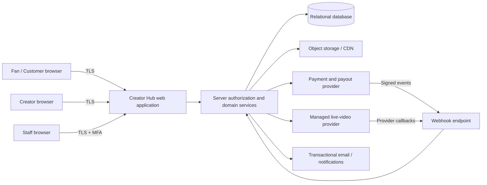
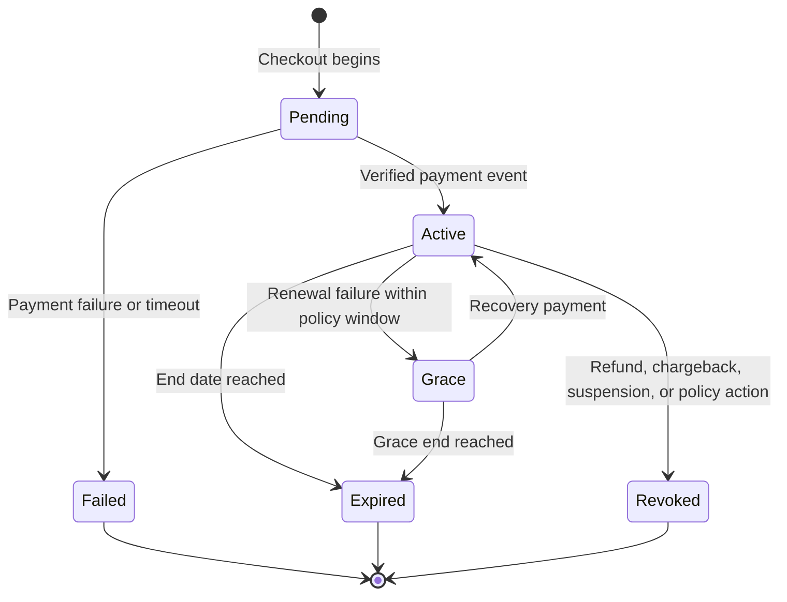

# Creator Hub — Architecture Baseline

**Author:** Manus AI  
**Status:** Initial implementation baseline  
**Scope:** Conventional creator–fan commerce and community platform. The release contains no AI features, AI-generated content, or AI-powered user workflows.

## Product Boundary

Creator Hub is a multi-tenant platform where a fan can discover creators, buy access to individual content or live events, hold recurring creator memberships, and manage purchases. A verified creator can maintain a public profile, publish paid or membership-only content, schedule live events, and view revenue records. Moderators and internal staff can act only within a restricted operational scope.

The first release is a modular full-stack application with a React client, typed server APIs, relational database, object-storage metadata, and integration seams for a payment processor, managed streaming provider, and CDN. Card numbers and other raw payment credentials do not enter the application; a payment provider owns collection and returns payment references and signed status events. The platform relies on a managed live-video provider rather than attempting to operate a custom video pipeline.

## Trust Boundaries

Every protected request terminates at the server authorization layer. The browser may hide unavailable actions for usability, but is never considered an authority for roles, ownership, price, payment status, or content access. Media URLs and stream playback credentials are issued only after a server-side entitlement decision and expire quickly.

## Identity, Roles, and Access Model

The platform uses layered authorization. **Role-based access control** constrains broad staff capabilities, while **ownership and relationship checks** enforce access to an individual creator’s resources and a fan’s purchased or subscribed entitlements. All protected endpoints reject access unless an explicit policy grants it. OWASP recommends least privilege, deny-by-default behavior, and authorization validation on every request.[1]

| Role | Primary authority | Explicit boundaries |
|---|---|---|
| Visitor | Read public creator and catalog pages | Cannot view protected content, enter paid live events, or change account data. |
| Fan | Manage own profile, purchases, memberships, and eligible access | Cannot change creator settings, see other users’ receipts, or access unentitled resources. |
| Creator | Create and manage own profile, products, content metadata, events, and audience tools | Cannot read another creator’s financial records or platform configuration. |
| Moderator | Act on reported content, chat, and audience conduct within assigned scope | Cannot modify payouts, payment state, prices, or global policy without separate authority. |
| Finance operations | Reconcile provider events and manage payout exceptions | Cannot change content or moderation outcomes beyond approved workflow. |
| Administrator | Manage role assignments, policies, platform configuration, and escalation workflows | Elevated actions require MFA, re-authentication, and immutable audit records. |

The first application schema can retain a single primary role for a user while representing creator approval, operational assignments, and resource ownership through dedicated tables. If a user later needs multiple staff responsibilities, the role capability model will be extracted into assignments without changing the ownership and entitlement policies.

## Entitlement Decision

Protected content and live-event entry are evaluated from an explicit entitlement record rather than from frontend state or a generic “paid” flag. An entitlement identifies the subject, resource scope, origin, validity period, status, and revocation reason. Its lifecycle supports one-time purchases, recurring creator memberships, platform admission passes, PPV content, paid live events, refunds, chargebacks, cancellation, and expiry.

Payment success displayed in the browser is not sufficient to grant access. The service grants, amends, or revokes access only after processing an authentic, idempotent provider event. Stripe’s webhook guidance requires HTTPS endpoints, signature verification against the raw request body, and a prompt success response before lengthy downstream work.[2]

## Domain Modules

| Module | Responsibility | Authoritative records |
|---|---|---|
| Identity and accounts | User lifecycle, account status, role, consent, session events | `users`, role/account-status fields, audit events |
| Creator operations | Creator approval, public profile, payout-readiness status | `creatorProfiles`, verification status |
| Catalog and content | Products, prices, visibility, media metadata, publication state | `products`, `contentAssets`, product-content links |
| Commerce and entitlements | Checkout intent, provider references, subscription/purchase lifecycle, access grants | `orders`, `payments`, `subscriptions`, `entitlements` |
| Revenue ledger | Gross proceeds, platform fees, refunds, reserves, creator payable balance | `ledgerEntries`, payout batches |
| Live events | Event metadata, schedules, ticket/product links, attendance tokens, chat moderation | `liveEvents`, stream sessions, attendance and moderation records |
| Advertising and disclosure | Placement inventory, sponsor disclosure, consent signals, review status | `adPlacements`, sponsorship campaigns, approvals |
| Governance | Reports, moderation actions, role changes, sensitive operations, policy versions | `reports`, `moderationActions`, `auditLogs` |

## Security and Operations Baseline

The implementation treats authentication, authorization, media delivery, payment events, and privileged actions as critical paths. Authentication relies on secure session management, verified email where applicable, rate limits, generic failure messages, credential recovery safeguards, and re-authentication after high-risk changes. OWASP notes that authenticated users are not automatically authorized for every resource and calls out horizontal access violations as a common concern.[1] Privileged roles must use multifactor authentication before production enablement.

Operational controls include server-side audit logs for security-relevant events, provider-event idempotency keys, segregated secrets, encrypted transport, database backups, error monitoring, permission review, and a release checklist. Internal staff access is separated from customer-facing authorization. The data design stores payment and payout references, not raw card data; it stores media file references and access policies, not large media bytes in the database.

## External-Service Decision Points

| Capability | Baseline | Implementation condition |
|---|---|---|
| Authentication | Existing managed application authentication, extended with verification and privileged-session policies | No AI functionality; no sensitive provider secrets in the client. |
| Checkout and subscriptions | Provider-hosted checkout with a server-side checkout adapter and signed webhooks | The payment provider is configured after the business confirms settlement country, currency, tax, and creator-payout needs. |
| Creator payouts | Marketplace/connected-account capability or an external payout operation | Requires legal, tax, KYC, and payout-provider review before live funds are moved. |
| File delivery | Object storage and CDN with server-issued, short-lived access | Production use requires a protected storage policy and media-provider configuration. |
| Live video | Managed low-latency streaming service with server-issued viewer tokens | First release provides event management and gated-entry interfaces; provider credentials are required for actual broadcast. |
| Ads | Clearly labeled placements, approval state, and consent-aware targeting | Targeting and disclosures require jurisdiction-specific policy review. |

## Non-Goals for the First Build

The initial build will not process raw payment data, issue tax advice, execute automated creator payouts without external provider configuration, claim complete protection against screen recording, operate its own streaming infrastructure, or provide any AI-derived recommendation, moderation, generation, or automation feature.

## References

[1]: https://cheatsheetseries.owasp.org/cheatsheets/Authorization_Cheat_Sheet.html "OWASP Authorization Cheat Sheet"
[2]: https://docs.stripe.com/webhooks "Stripe — Receive webhook events"
