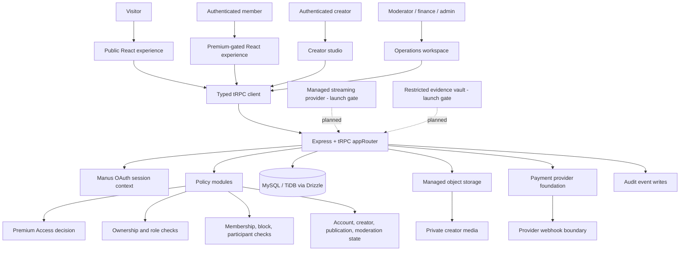

# Creator Hub — Full Engineering Packet

**Document status:** Implementation-aligned engineering packet  
**Prepared by:** Manus AI  
**Product:** Creator Hub  
**Current release checkpoint:** the published checkpoint attached with this packet  
**Published domain:** `https://creatortap-ahmwcikp.manus.space`  
**Primary repository path:** `/home/ubuntu/creator-fan-platform`

> This packet describes the implementation that exists in the repository, the product and architecture decisions that constrain it, and the work that remains before a production launch. It is not a legal, tax, payment-provider, age-assurance, or regulatory approval. Those decisions require qualified review and written provider approval.

## 1. Executive Summary

Creator Hub is a non-AI creator monetization platform for human creators and paying members. Its experience combines creator-hosted profile pages, paid content, creator subscriptions, live-event entry, direct engagement, and a platform-level Premium Access membership. The defining access decision is that an authenticated account must hold active Premium Access before it can enter the real creator network or perform network actions such as discovery, following, messaging, creator-offer checkout, or protected live-event entry.

The implemented system is a full-stack React, Express, tRPC, Drizzle, and MySQL/TiDB application. Authentication is provided through the configured Manus OAuth flow. The browser uses typed tRPC procedures; the server performs entitlement, account-state, ownership, relationship, and staff-scope checks. Content metadata is stored in the relational database while creator media is uploaded to managed object storage through server-created upload targets. Payment and streaming boundaries are represented as provider-dependent foundations rather than a claim that the adult-industry production provider configuration is complete.

The current public visual system is a matte-black editorial interface with restrained neon-pink accents, Old English display typography, readable body typography, cursive photographic treatments, glass-depth cards, grain, vignette, and reduced-motion-aware transitions. The featured creator is **Kaden McCullen**, with the confirmed social handle **@itskadenbro**. The latest supplied brief used the spelling “Caden McCullen”; the earlier direct instruction to use “Kaden McCullen” is treated as canonical and is reflected in the site and this packet.

| Area | Current state | Engineering interpretation |
|---|---|---|
| Public experience | Implemented | Landing, age acknowledgement, safety, Premium Access entry, creator application, and public policy-oriented surfaces exist. |
| Premium gate | Implemented | Premium Access is enforced in protected route wrappers and server procedures. |
| Creator onboarding | Implemented foundation | Application submission, review states, eligibility/payout readiness states, and creator publishing gates exist. |
| Paid content | Implemented foundation | Posts, products, subscriptions, PPV states, entitlements, checkout foundation, and protected media registration exist. |
| Live experiences | Implemented foundation | Event scheduling, entitlement-aware live-event checks, and lobby interfaces exist; provider-backed playback/chat remains a launch gate. |
| Messaging and safety | Implemented foundation | Conversations, contact policy, bilateral blocks, public reporting, staff report review, and audit events exist. |
| Staff operations | Implemented foundation | Operations dashboard and scoped queues exist for applications, reports, media, and advertising. |
| Payments | Provider-dependent | Hosted checkout and Stripe foundation exist in code, but adult-industry eligibility and production fund flows are not approved or activated. |
| Restricted evidence vault | Not complete | The architecture specifies a separate evidence boundary; the production vault still needs to be integrated. |
| Automated verification | Passing | Type checking passes and 17 automated tests pass across 7 test files. |

## 2. Product Intent and Confirmed Decisions

### 2.1 Product concept

The supplied product brief describes a creator monetization platform combining two familiar patterns: live rooms with donations or gifting and creator profile pages with paid content. The implementation adopts the intent while retaining explicit boundaries around payment-provider approval, live-stream infrastructure, moderation, privacy, and the distinction between public previews and the real premium network.

The platform is explicitly **not an AI product**. No AI feature, model call, AI moderation dependency, or AI-generated content workflow is part of the implemented product scope.

### 2.2 Canonical creator metadata

The current featured creator presentation is the following:

| Field | Value |
|---|---|
| Display name | Kaden McCullen |
| Handle | `kaden-mccullen` |
| Instagram | `@itskadenbro` |
| Category | Featured creator |
| Featured image | `/manus-storage/kaden-mccullen_560fb805.jpeg` |
| Membership presentation | `$9 / month` |
| Current display status | Live now |
| Next event label | Open studio session |

The Instagram handle is stored as optional creator catalog metadata and is displayed on creator cards, the homepage featured treatment, and the creator profile as an external Instagram link. It is presentation metadata only; it is not an authentication credential, payment identifier, or substitute for a verified creator record.

### 2.3 Premium-entry model

Premium Access is the platform-level entry entitlement. It is separate from creator subscriptions, PPV purchases, live-event tickets, tips, and resource-specific entitlements. The current policy is cumulative: a member must have active Premium Access **and** satisfy the creator or resource-level rule before protected content, contact, checkout, or playback is permitted.

Public pages can explain the product, plans, safety rules, creator application, and launch state without exposing private creator-network data. Protected pages use the client `PremiumAccessGate` and server procedures use explicit premium status checks. The server remains authoritative because a browser-visible route or button is not an authorization boundary.

## 3. System Context and Component Architecture



The deployed application is a modular monolith. This is an intentional MVP architecture: it keeps domain logic close to the typed API and relational data model while preserving adapter boundaries for storage, payments, streaming, and future compliance evidence. The architecture should be split into services only when traffic, operational isolation, or restricted evidence requirements justify the additional deployment and security surface.

### 3.1 Runtime layers

| Layer | Implemented technology | Primary responsibility |
|---|---|---|
| Browser | React 19, Wouter, Tailwind CSS 4, shadcn/Radix components | Accessible public pages, protected workspace surfaces, loading and empty states, route-level premium presentation. |
| Client data | tRPC React bindings and TanStack Query | Typed request/response integration, cache management, auth and feature queries. |
| HTTP server | Express 4 and the project’s server runtime | Static delivery, OAuth callback integration, tRPC transport, storage proxy, runtime startup. |
| API contract | tRPC 11 and Zod | Typed procedures, input validation, procedure grouping, server-side policy execution. |
| Domain logic | `server/platform/*` modules | Premium decisions, authorization helpers, creator applications, media validation, messaging checks. |
| Persistence | Drizzle ORM with MySQL/TiDB | Users, plans, subscriptions, creators, posts, products, orders, entitlements, events, messages, safety, ads, and audit rows. |
| Object storage | S3-compatible managed storage | Creator media bytes and managed asset delivery. |
| External identity | Manus OAuth | Session establishment, current-user context, logout, and account identity reference. |
| Payments | Stripe foundation plus provider adapter boundary | Hosted checkout shape, provider references, pending orders, and webhook-oriented fulfillment foundation. Production adult-industry provider approval remains required. |

## 4. Repository and Code Organization

```text
client/
  index.html                 Browser document and font setup
  src/
    App.tsx                  Route registration and global providers
    index.css                Design tokens, typography, texture, motion, and image treatment
    const.ts                 Login entry and shared frontend constants
    lib/catalog.ts           Featured and illustrative creator metadata
    lib/trpc.ts              Typed tRPC client binding
    components/              Site header, gates, dashboard shells, and UI primitives
    pages/                   Public pages, creator pages, dashboards, studio, live, safety, operations

server/
  _core/                     OAuth, context, cookies, runtime, storage proxy, server infrastructure
  db.ts                      Drizzle query helpers and persistence operations
  routers.ts                 appRouter and concrete tRPC procedures
  platform/
    access.ts                Role, account, ownership, block, and premium access decisions
    premium.ts               Premium Access decision mapping
    creatorApplication.ts    Creator application eligibility and workflow helpers
    media.ts                 Media type, size, and filename policy
    messaging.ts             Conversation and participant policy helpers
  payments/
    stripe.ts                Provider client foundation
    stripeProducts.ts        Product-to-provider price mapping
    stripeWebhook.ts         Webhook boundary foundation
  storage.ts                 Storage upload target and managed URL helpers

 drizzle/
  schema.ts                  Relational schema and indexes
  relations.ts               Drizzle relations
  migrations/                Generated migration location

 shared/
  _core/errors.ts            Shared error types
  const.ts                   Shared constants
  types.ts                   Shared cross-layer types

docs/
  engineering-packet.md      This implementation-aligned packet
  documentation-index.md     Canonical documentation map
  functional-specification-v2.md
  technical-specification-v2.md
  operations-launch-specification-v2.md
  feature-audit-2026-08-27.md
  implementation-status-and-launch-gates.md
  premium-entry-model.md
  research-findings/         Supporting governance and provider research
```

## 5. Frontend Route Inventory

The route table below is derived from `client/src/App.tsx`. A route being registered does not make it public: several routes are wrapped by `PremiumAccessGate`, while server procedures independently enforce the same boundary.

| Route | Page | Access behavior | Current purpose |
|---|---|---|---|
| `/` | `Home` | Public | Editorial landing page, age acknowledgement, featured creator, collection preview, approach, early-circle note, and safety terms. |
| `/join` | `PremiumAccess` | Public plan/status entry | Premium Access explanation, plan state, provider approval notice, and secure sign-in/checkout entry foundation. |
| `/apply` | `CreatorApplication` | Auth-aware application flow | Creator application submission and eligibility messaging. |
| `/studio/live` | `CreatorEvents` | Authenticated creator workflow | Creator event scheduling interface. |
| `/studio/contact` | `CreatorContactSettings` | Authenticated creator workflow | Message-policy and tips preference interface. |
| `/explore` | `Explore` | `PremiumAccessGate` | Premium creator collection and search/filter preview. |
| `/creator/:handle` | `CreatorProfile` | `PremiumAccessGate` | Creator profile, paid membership presentation, protected-content explanation, social link, and live-session preview. |
| `/dashboard` | `AccountHub` | Auth-aware workspace | Account status, membership and activity workspace. |
| `/studio` | `CreatorStudio` | Auth-aware creator workspace | Creator publishing and media workflow presentation. |
| `/live` | `LiveLobby` | `PremiumAccessGate` | Premium live-event lobby and entitlement-aware entry foundation. |
| `/inbox` | `Inbox` | `PremiumAccessGate` | Premium-gated messaging workspace. |
| `/safety` | `SafetyCenter` | Public | Reporting, safety, restrictions, and human-review explanation. |
| `/operations` | `OperationsDesk` | Staff checks in data layer | Operations summary and moderation/review queues. |
| `/404` | `NotFound` | Public | Explicit not-found presentation. |

## 6. Authentication, Sessions, and Account State

Authentication is delegated to the configured Manus OAuth service. The OAuth callback establishes the session cookie; server request context resolves the current user; `protectedProcedure` exposes that user to protected tRPC procedures. The application does not store passwords or raw card credentials in the project schema.

The `users` table stores the provider `openId`, display name, email reference, login method, role, account status, age acknowledgement timestamp, marketing consent timestamp, and lifecycle timestamps. Roles are `fan`, `creator`, `moderator`, `finance`, and `admin`. Account states are `active`, `pending_review`, `suspended`, and `closed`.

The current implementation includes a public `auth.me` query and public logout mutation. High-risk production operations still require the configured identity provider’s assurance, re-authentication or MFA policy, and operational review. The architecture explicitly separates ordinary account/profile data from restricted age, identity, consent, and compliance records.

## 7. Authorization and Access-Control Design

### 7.1 Policy composition

Authorization is a deny-by-default composition of:

| Dimension | Examples in implementation |
|---|---|
| Role | Creator publishing, moderator review, finance/admin operations. |
| Account state | Active account required for purchases, creator actions, and engagement. |
| Premium entitlement | `premium_access` must be active before network entry. |
| Resource entitlement | Creator membership, post, live-event, or bundle entitlement may be required after Premium Access. |
| Ownership | Creator can draft only against their own approved creator profile and post. |
| Relationship | Message participant, creator membership, follow state, or block state. |
| Content state | Published post, active product, scheduled/live event, moderation status. |
| Operational scope | Staff capabilities and case/resource scope. |

### 7.2 Implemented policy functions

The server imports and uses `canEnterPremiumNetwork`, `canAccessProtectedResource`, `canPurchaseFromCreator`, `canAdministerPlatform`, `canModeratePlatform`, `hasActiveAccount`, `canSubmitCreatorApplication`, `isConversationParticipant`, and `canOpenConversation`. These helpers are called in procedures rather than trusting UI visibility.

### 7.3 Premium gate matrix

| Action | Server check | Result if denied |
|---|---|---|
| View real creator network | Active Premium Access plus active account | Forbidden with Premium Access message. |
| Follow creator | Premium Access plus approved creator profile | Forbidden or unavailable creator response. |
| Open creator conversation | Premium Access, creator contact policy, participant relationship, no block | Forbidden with contact-policy message. |
| List conversations | Premium Access and active account | Forbidden with Premium Access message. |
| Purchase creator offer | Active account, Premium Access, active product, creator purchase policy | Forbidden or unavailable offer. |
| Check post access | Premium Access plus creator membership/post entitlement/ownership rules | Safe access decision without media bytes. |
| Check live-event access | Premium Access plus event state and membership/ticket entitlement | Safe access decision without playback credential. |
| Creator draft post | Approved creator profile plus payout readiness | Forbidden until review and payout readiness. |
| Upload media | Accepted MIME/size, owned post, approved creator, payout readiness | Bad request or forbidden. |
| Staff review | Moderator/admin capability and procedure-specific scope | Forbidden and audit requirement. |

## 8. Actual API Surface

All procedures are grouped under the exported `appRouter` in `server/routers.ts`. Inputs are Zod-validated. The following list is the concrete implementation surface rather than a future-state API proposal.

| Router | Procedures | Implementation behavior |
|---|---|---|
| `system` | Template system procedures | Framework-provided system surface. |
| `auth` | `me`, `logout` | Returns current session user or clears the session cookie. |
| `premium` | `plans`, `status` | Lists active Premium Access plans and returns decision plus current platform subscription. |
| `creatorApplication` | `me`, `submit` | Returns application or `null`; validates display name, handle, agreement acceptance, eligibility, and writes submission audit. |
| `creator` | `publishingStatus`, `createPost`, `createMediaUploadTarget`, `registerMedia`, `createLiveEvent`, `updateContactSettings` | Enforces creator approval, payout readiness, ownership, media restrictions, future event dates, and contact-policy state. |
| `member` | `followCreator`, `blockAccount`, `unblockAccount` | Premium-gated follow, bilateral blocking, self-block prevention, and audit events. |
| `messaging` | `open`, `send`, `list`, `history` | Premium-gated network entry, contact policy, participant checks, block checks, and audit on message send. |
| `operations` | `summary`, `creatorApplications`, `reviewCreatorApplication`, `reports`, `resolveReport`, `pendingAssets`, `reviewAsset`, `pendingAds`, `reviewAd` | Staff-only queues and review mutations with capability checks and audit writes. |
| `access` | `post`, `liveEvent` | Returns an entitlement-aware access decision without returning protected media or playback URLs. |
| `checkout` | `create` | Requires active account and Premium Access, creates hosted Stripe Checkout foundation, creates pending order, and writes audit event. Production provider eligibility remains unresolved. |
| `safety` | `report` | Public report submission for profile, post, asset, message, live event, or ad; attaches reporter when authenticated. |

## 9. Relational Data Model

The implemented schema in `drizzle/schema.ts` contains the following tables.

| Table | Purpose | Important state or ownership fields |
|---|---|---|
| `users` | Account and role record | `role`, `accountStatus`, age acknowledgement, marketing consent. |
| `platformAccessPlans` | Premium Access plan catalog | `code`, price, currency, provider references, `draft/active/archived`. |
| `platformSubscriptions` | Platform-level subscription cache | Provider references, `pending/active/grace/canceled/expired/revoked`. |
| `creatorProfiles` | Creator identity and publishing profile | Handle, display name, discoverability, approval, payout, message policy, tips setting. |
| `creatorApplications` | Creator onboarding workflow | Agreement version, eligibility, payout readiness, review status, reviewer and timestamps. |
| `membershipTiers` | Creator subscription tiers | Creator, name, prices, active flag, sort order. |
| `posts` | Creator post metadata | Access type, membership tier, PPV price, publication state. |
| `contentAssets` | Private media metadata | Storage key, MIME, byte size, moderation state, post association. |
| `products` | Commerce catalog | Product type, price, creator/resource association, active state. |
| `orders` | Purchase transaction reference | Buyer, creator, product, totals, platform fee, provider references, order state. |
| `subscriptions` | Creator subscription relationship | Fan, creator, tier, provider reference, lifecycle state. |
| `entitlements` | Server access grants | User, resource type/id, source type/id, status, validity interval, revoke reason. |
| `liveEvents` | Event schedule and provider reference | Access type, schedule, lifecycle state, provider stream ID. |
| `tips` | Tip transaction foundation | Fan, creator, optional post/live event, amount and provider references. |
| `conversations` | Direct-message relationship | Fan, creator, state, timestamps. |
| `creatorFollows` | Follow relationship | User/creator relationship and uniqueness. |
| `accountBlocks` | Bilateral block state | Blocking user, blocked user, reason, timestamps. |
| `messages` | Conversation messages | Conversation, sender, body, state, timestamps. |
| `adPlacements` | Sponsorship/advertising placement state | Sponsor, disclosure, approval, current window, placement status. |
| `reports` | Public and authenticated safety reports | Subject type/id, reporter, reason, detail, status. |
| `moderationActions` | Staff moderation history | Report/target, actor, action, rationale and timestamps. |
| `auditLogs` | Append-oriented accountability record | Actor, action, target, metadata, timestamps. |

The schema intentionally stores provider references and workflow states rather than passwords, raw payment-card data, or ordinary-query copies of restricted compliance evidence. The future evidence vault must remain a separate controlled boundary with case-scoped access and independent audit.

## 10. Main Workflows

### 10.1 Visitor to Premium member

1. A visitor reaches the public landing page and sees the product concept, age acknowledgement, safety language, and illustrative creator preview.
2. The visitor selects Premium Access through `/join`.
3. The Premium Access page displays plan state. When no plan is configured, it explicitly states that payment details are not collected until an approved adult-industry provider, terms, and plan are configured.
4. Authentication is initiated through the configured OAuth entry point.
5. A configured provider checkout or account workflow creates the platform subscription.
6. A verified provider event should update the platform subscription and grant the `premium_access` entitlement idempotently.
7. The server then permits protected network actions according to the current entitlement and account state.

### 10.2 Creator application and publishing

1. A signed-in account submits display name, proposed handle, optional category/note, and agreement acceptance.
2. The server checks creator-application eligibility and records an application plus audit event.
3. Staff/admin review can transition application status, eligibility status, and payout readiness.
4. Creator publishing is enabled only when approval is `approved` and payout readiness is `ready`.
5. Approved creators draft posts with `public`, `members`, `ppv`, or `private` access types. PPV drafts require an unlock price.
6. Media upload targets are generated only after MIME, size, ownership, creator approval, and payout checks.
7. The media is registered by storage key and begins in pending moderation state.
8. Staff review may approve or reject the media; publication and delivery remain separate decisions.

### 10.3 Protected content access

1. A protected access request arrives at `access.post`.
2. The server verifies active Premium Access.
3. It loads the post and creator access subject.
4. It finds current entitlements and checks post or creator-membership grants.
5. It applies publication state, ownership, access type, account, and relationship rules.
6. It returns a safe boolean/reason without returning source media bytes or a permanent public URL.

### 10.4 Checkout and entitlement lifecycle

The current checkout foundation creates a hosted Stripe Checkout session for an active product, records a pending order using the provider checkout ID, and writes an audit event. The code explicitly requires Premium Access before creator-offer checkout. The production workflow still requires an approved adult-industry payment/acquiring and payout provider, signed webhook verification, idempotent event processing, refund/chargeback handling, reserve accounting, reconciliation, and tax/reporting ownership.

### 10.5 Messaging and safety

Opening a conversation requires Premium Access, a creator profile, the creator’s message policy, current creator membership when required, and no bilateral block. Sending a message requires participant membership, an open conversation, no block, body-length validation, and audit logging. Public reports can be filed against profiles, posts, assets, messages, live events, and advertisements. Staff procedures expose open reports and media/ad/application review queues according to role.

### 10.6 Live-event foundation

Creators can schedule future events with `members`, `ticketed`, or `private` access types after approval and payout readiness checks. The `access.liveEvent` procedure verifies Premium Access, event existence and state, current resource entitlement, and creator/resource ownership rules. Actual low-latency playback, chat transport, token issuance, moderation tooling, and stream-provider lifecycle remain integration work.

## 11. Media and Storage Architecture

Creator media is not committed to the frontend repository. The server creates managed upload targets under creator/post-scoped storage keys, validates accepted content types and byte sizes, sanitizes filenames, verifies ownership, and registers only metadata in `contentAssets`. The storage proxy serves managed paths while the application retains authority over whether an asset should be exposed.

This architecture protects against accidental public asset commits and separates media bytes from relational query data. It does not make redistribution or screen capture impossible. Production delivery should use private origins, expiring signed URLs or provider credentials, CDN access controls, watermarking where appropriate, abuse monitoring, and incident response.

## 12. Payments, Payouts, and Revenue Accounting

The schema includes platform plans, creator memberships, products, orders, subscriptions, entitlements, tips, provider references, and platform fee fields. The server does not store raw payment-card data. Hosted checkout is the intended payment collection boundary.

The current project includes Stripe foundation code and a test sandbox configuration, but this does not mean the adult-industry fund flow is approved for production. An approved provider must confirm content category eligibility, recurring billing, creator payouts, refunds, chargebacks, reserves, dispute handling, KYC/KYB requirements, supported countries/currencies, tax reporting, and platform commission handling. Token, power, and gift mechanics are currently a product and provider-definition gate; their unit value, pricing, redemption, ledger treatment, creator payout, refund behavior, and abuse controls must be specified before activation.

## 13. Security, Privacy, and Governance Controls

| Control area | Current implementation or documented rule | Remaining production work |
|---|---|---|
| Authentication | Hosted OAuth session and server context | Configure production identity, account recovery, re-authentication, and privileged MFA. |
| Authorization | Role, account, premium, ownership, relationship, resource, and staff checks | Complete policy coverage for every production endpoint and perform BOLA/privilege-escalation testing. |
| Premium privacy gate | Client gate plus server premium checks | Verify all public queries cannot leak real creator-network data or existence-sensitive details. |
| Payment safety | Hosted checkout foundation and provider references | Obtain adult-industry provider approval and complete signed webhook/idempotency implementation. |
| Media safety | Private storage path, upload validation, moderation state | Add expiring delivery credentials, CDN policy, abuse controls, and deletion/retention process. |
| Restricted evidence | Architecture requires separate vault/index and case-scoped access | Build or integrate vault; never place raw evidence in ordinary profile or application tables. |
| Auditability | Audit writes exist for important application, creator, media, messaging, operations, and checkout actions | Define retention, immutable storage, time synchronization, alerting, and audit review procedures. |
| Safety | Public reports, blocks, moderation queues, and human-accountable operations | Define escalation SLAs, crisis/safety procedures, appeals, and staff training. |
| Privacy | Age acknowledgement, marketing consent, policy boundaries, and minimized data model | Finalize notice, rights request, deletion, retention, vendor map, and jurisdiction-specific review. |
| Advertising | Ad placement and review states with disclosure fields | Add consent-aware serving, sponsor approvals, measurement controls, and final advertising policy. |

## 14. Testing and Verification

The repository currently contains eight Vitest files and 18 passing tests. The suite covers logout behavior, product/price mapping, authorization and access policies, creator applications, media validation, messaging policy, Premium Access logic, and the confirmed featured-creator Instagram metadata.

| Test file | Coverage focus |
|---|---|
| `server/auth.logout.test.ts` | Session logout behavior. |
| `server/payments/stripeProducts.test.ts` | Product-to-checkout price mapping. |
| `server/platform/access.test.ts` | Premium/resource access decisions and account/relationship rules. |
| `server/platform/creatorApplication.test.ts` | Application eligibility and workflow conditions. |
| `server/platform/media.test.ts` | Media type, size, filename, and storage-key safety. |
| `server/platform/messaging.test.ts` | Contact policy, participant, and block behavior. |
| `server/platform/premium.test.ts` | Premium Access decision mapping. |
| `client/src/lib/catalog.test.ts` | Kaden McCullen display name and `@itskadenbro` metadata. |

The latest validation run completed with `pnpm check` and `pnpm test`. TypeScript reported no errors, all eight test files passed, and all 18 tests passed. Desktop and mobile visual verification was performed for the homepage, `/join`, and creator profile/premium-gated surfaces during the feature and content-update cycles.

The current test suite is not a substitute for production acceptance testing. Before launch, add provider sandbox integration tests, webhook replay/idempotency tests, end-to-end payment and entitlement tests, storage delivery tests, live playback token tests, access-control negative tests, rate-limit tests, security scanning, resilience tests, and operational acceptance tests.

## 15. Deployment and Environment State

| Item | Current state |
|---|---|
| Hosting | Managed autoscale WebDev deployment. |
| Live domain | `creatortap-ahmwcikp.manus.space` |
| Latest checkpoint | `cc4b4867` before the current Instagram/documentation changes; a new checkpoint is required after validation. |
| Database | MySQL/TiDB via `DATABASE_URL`. |
| Session/auth secrets | Injected environment configuration including `JWT_SECRET`, OAuth URLs, and app IDs. |
| Storage | Managed S3-compatible storage helpers and `/manus-storage/*` proxy paths. |
| Payment secrets | Stripe test sandbox foundation is present; adult-industry provider approval and production credentials remain launch gates. |
| Streaming | No managed streaming provider is activated. |
| Restricted evidence | Not yet implemented as a separate production vault. |
| AI | No AI features are part of the product. |

The deployment process is checkpoint-driven. A successful checkpoint publishes the project in the current autoscale environment. Any change to secrets, schema, payment provider, or streaming provider must be validated separately and documented with rollback and incident procedures.

## 16. Engineering Workflow and Change Discipline

Feature changes follow the project’s typed full-stack loop:

1. Register the requested work in `todo.md`.
2. Update the Drizzle schema when persistence changes are required.
3. Generate and apply migrations through the project’s database migration workflow; destructive data operations require explicit review.
4. Add database helpers in `server/db.ts`.
5. Add typed tRPC procedures and server-side policy checks in `server/routers.ts` or the relevant domain module.
6. Wire the UI through the tRPC client, with loading, error, and empty states.
7. Add or update Vitest coverage.
8. Run `pnpm check` and `pnpm test`.
9. Verify key routes at desktop and mobile sizes.
10. Read the complete task register, mark only accurately completed items as `[x]`, and save a checkpoint.

This workflow treats server authorization and automated tests as release requirements, not optional polish.

## 17. Completed Work Register

The following implementation areas are complete or have a working foundation in the current repository:

- Non-AI product domain, role model, and premium-entry architecture.
- React public experience with editorial landing page, creator collection, creator profile, safety surface, and Premium Access entry.
- Authenticated account, creator studio, creator application, live scheduling, contact settings, inbox, live lobby, and operations surfaces.
- Relational schema for accounts, Premium Access, creators, applications, tiers, posts, assets, products, orders, subscriptions, entitlements, events, tips, messaging, blocks, ads, reports, moderation, and audit logs.
- Server-enforced premium access, protected resource checks, ownership checks, contact policy, blocks, role separation, media validation, creator readiness checks, and audit events.
- Managed storage upload-target foundation and protected asset metadata workflow.
- Hosted checkout foundation and provider-reference order creation.
- Kaden McCullen featured imagery, display metadata, and Instagram handle `@itskadenbro` across the homepage, cards, and creator profile.
- Matte-black, neon-pink, Old English/cursive editorial design system with high-class depth, grain, vignette, and reduced-motion behavior.
- Source-backed functional, technical, operations, compliance-boundary, and launch documentation set.
- Automated validation with 18 passing tests and successful type checking, including the featured creator metadata assertion.

## 18. Outstanding Launch Gates and Recommended Order

The application is an implementation baseline rather than a fully approved adult-industry production operation. The recommended order is:

1. Confirm the legal entity, launch jurisdictions, product categories, minimum-age policy, consent/rights policy, privacy notice, terms, tax obligations, and recordkeeping responsibilities with qualified counsel.
2. Obtain written approval from an adult-industry payment/acquiring and payout provider for the exact fund flow, creator category, recurring billing, PPV, tips, gifting, reserves, refunds, and chargebacks.
3. Implement provider webhook signature verification, idempotency, reconciliation, dispute handling, payout ledger, reserve logic, and operational finance controls.
4. Integrate managed streaming with entitlement-gated short-lived playback tokens, creator broadcast lifecycle, moderation controls, chat, reports, and incident handling.
5. Build the restricted evidence vault with encrypted storage, narrow roles, case-scoped grants, retention/legal holds, access logging, and no generic administrator bypass.
6. Replace illustrative public creator records with approved database-backed profiles and ensure no private creator details leak before Premium Access.
7. Complete end-to-end, security, performance, resilience, accessibility, abuse, and operational acceptance testing.
8. Establish launch runbooks for payment incidents, content reports, account restrictions, creator appeals, privacy requests, data recovery, vendor outages, and live-event safety.

## 19. Open Product and Engineering Decisions

The following questions remain intentionally explicit rather than being silently invented in code:

| Decision | Why it matters |
|---|---|
| Platform-wide Premium Access price and cadence | Determines the entry entitlement and checkout product configuration. |
| Creator account economics | Clarifies whether creators pay, receive complimentary beta access, or enter under a separate commercial agreement. |
| Token/power/gift definition | Determines wallet, ledger, redemption, refund, payout, tax, and abuse controls. |
| Live concurrency and latency target | Determines managed provider tier, autoscale/reserved hosting, and moderation staffing. |
| Payment and payout countries/currencies | Determines provider eligibility, KYC/KYB, taxes, reserves, and settlement operations. |
| Private-detail visibility policy | Defines exactly what is public before Premium Access and what is shown after payment. |
| Beta incentive program | Requires written eligibility, tracking, payout, tax, conduct, and disclosure terms. |
| Restricted evidence provider | Determines vault, index, retention, legal hold, and access-review implementation. |
| Advertising launch scope | Determines approval workflow, disclosures, consent, and measurement boundaries. |

## 20. References

The following references are the implementation and specification sources used for this packet. Line-level claims should be reconciled against the source files before a production change is approved.

[1]: ../client/src/App.tsx "Creator Hub frontend route registration"
[2]: ../client/src/pages/Home.tsx "Creator Hub homepage and public messaging"
[3]: ../client/src/pages/PremiumAccess.tsx "Premium Access page implementation"
[4]: ../client/src/pages/CreatorProfile.tsx "Creator profile implementation"
[5]: ../client/src/components/CreatorCard.tsx "Creator card implementation"
[6]: ../client/src/lib/catalog.ts "Creator catalog and featured metadata"
[7]: ../server/routers.ts "Concrete tRPC application router"
[8]: ../server/platform/access.ts "Server authorization and access policies"
[9]: ../server/platform/premium.ts "Premium Access decision logic"
[10]: ../server/platform/creatorApplication.ts "Creator application eligibility helpers"
[11]: ../server/platform/media.ts "Media validation and filename policy"
[12]: ../server/platform/messaging.ts "Messaging and participant policy helpers"
[13]: ../server/db.ts "Database query and persistence helpers"
[14]: ../drizzle/schema.ts "Drizzle relational schema"
[15]: ../server/payments/stripe.ts "Payment provider foundation"
[16]: ../server/payments/stripeProducts.ts "Provider price mapping foundation"
[17]: ../server/payments/stripeWebhook.ts "Webhook boundary foundation"
[18]: ../server/storage.ts "Managed storage helpers"
[19]: ../docs/functional-specification-v2.md "Canonical functional specification"
[20]: ../docs/technical-specification-v2.md "Canonical technical specification"
[21]: ../docs/operations-launch-specification-v2.md "Canonical operations and launch specification"
[22]: ../docs/feature-audit-2026-08-27.md "Completed feature audit"
[23]: ../docs/implementation-status-and-launch-gates.md "Implementation status and launch gates"
[24]: ../package.json "Project scripts and dependencies"
[25]: ../todo.md "Project task register"
