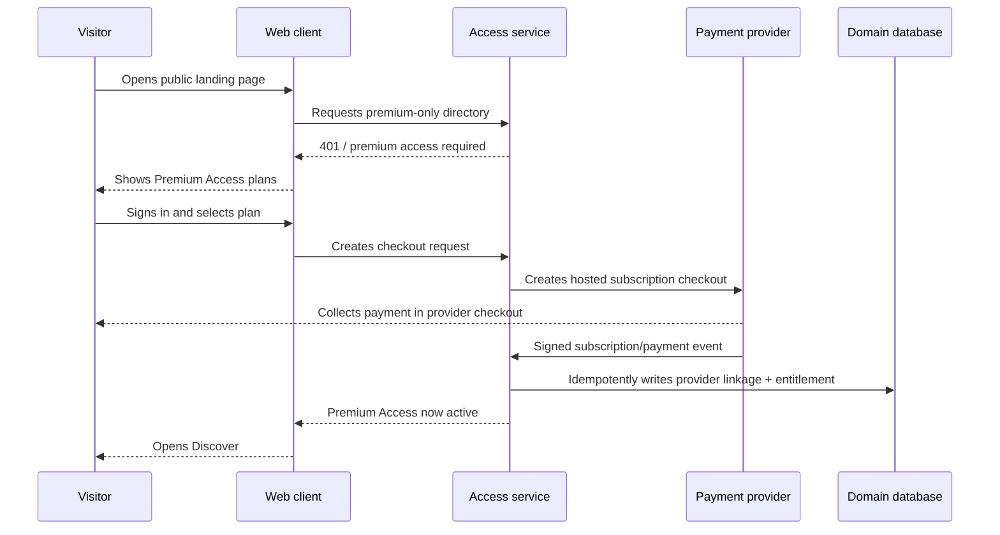
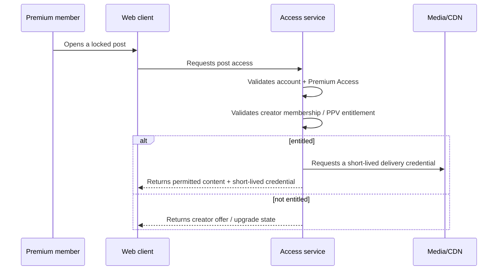
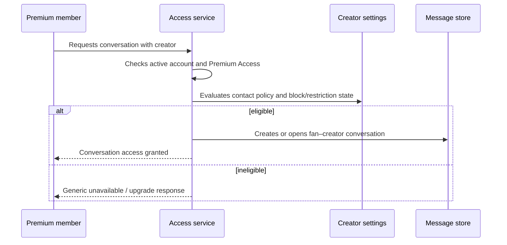

# Creator Hub — Product Feature Specification

**Author:** Manus AI  
**Status:** Implementation specification  
**Product model:** Conventional, non-AI creator platform with platform-level Premium Access before any fan discovery or engagement.

## 1. Product Intent and Success Criteria

Creator Hub enables individual creators to operate paid, direct-to-fan spaces without giving unpaid visitors access to the network itself. A person may learn about the platform, create an account, or apply to be a creator from the public area. However, **Premium Access is required before a fan can browse creators, contact creators, participate in community features, or make creator-level purchases**. The platform’s paid entry is therefore a membership authorization boundary, not a cosmetic landing-page overlay.

The product has no AI-generated content, recommendations, automated content generation, or AI moderation. Creator discovery order, eligibility, moderation outcomes, and access rights must be deterministic and explainable.

| Objective | Product measure | Release acceptance signal |
|---|---|---|
| Preserve creator–fan value | Fans who reach a full creator space are eligible premium members. | Unpaid accounts cannot resolve protected directory, profile, engagement, or checkout APIs. |
| Keep paid access reliable | Entitlement status changes only from verified payment/provider actions or audited staff action. | Checkout completion or subscription state is processed idempotently; return-page state alone never grants access. |
| Protect creator control | Creators choose prices, availability, contact policy, and eligible audience. | A creator cannot manage another creator’s products, posts, assets, event settings, or revenue data. |
| Support accountable operations | Safety, financial, and approval decisions are attributable. | Relevant actions write a timestamped audit event with actor, action, target, outcome, and reason where applicable. |
| Avoid misleading promotion | Sponsored material is clearly labeled and approval-gated. | Unapproved placements are not served; approved material has a disclosure label. |

## 2. User Types and Capability Model

| User type | Entry condition | Permitted core actions | Explicit exclusions |
|---|---|---|---|
| Public visitor | No account required | View product information, eligibility notices, plan options, help, policy pages, and creator-application entry. | Cannot see the full creator directory, full profiles, member feed, creator offers, contact controls, or live catalog. |
| Registered unpaid account | Authenticated but no active Premium Access | Complete profile, manage billing, buy/renew Premium Access, submit creator application, view support/appeal information. | Cannot browse/engage network or purchase creator-level content. |
| Premium member | Active account and valid Premium Access | Browse full directory, open creator spaces, follow/contact subject to creator controls, make creator-level purchases, view eligible library and events. | Cannot bypass creator-level membership, PPV, ticket, ownership, age, or safety restrictions. |
| Approved creator | Creator approval, active account, required agreements/payout readiness | Maintain own profile, offers, posts, assets, events, audience settings, and revenue status. | Cannot access another creator’s account/revenue; cannot use staff-only controls. |
| Moderator | Active staff assignment | Review reports and take scoped moderation actions. | Cannot alter payout settings, card data, platform fee policy, or unrelated records. |
| Finance operations | Active staff assignment | Reconcile payments/payouts, manage finance exceptions, access required transaction history. | Cannot publish content, override moderation, or assign staff roles without separate authority. |
| Administrator | Elevated active staff assignment with strong authentication | Manage platform policy, staff assignments, creator approval escalation, and critical settings. | Must still operate through audited flows; may not bypass provider requirements. |

## 3. Information Architecture

### 3.1 Public experience

The public site has a concise purpose: explain the platform, state its age/eligibility framing, offer Premium Access, and accept creator applications. It deliberately does not become an open gallery of real creators. This reduces unsolicited contact and gives the paywall its intended meaning.

| Public route/surface | Required content | Primary action | Access behavior |
|---|---|---|---|
| Landing page | Platform value proposition, premium-entry explanation, plan preview, safety summary, creator application callout | “Get Premium Access” | Public |
| Plan selection | Monthly and annual Premium Access plans, price/tax copy, cancellation/refund links, supported payment methods | “Continue to secure checkout” | Public or authenticated; payment creation requires sign-in |
| Sign-in / account creation | Identity options, age acknowledgement, terms/privacy consent, generic error copy | “Create account” / “Sign in” | Public |
| Creator application | Eligibility, agreements, onboarding steps, support path | “Apply as a creator” | Public entry; submission requires authenticated account |
| Policy center | Terms, privacy, acceptable-use, safety/reporting, copyright, billing, and help materials | “Report a concern” | Public |

### 3.2 Premium member experience

Once a user holds Premium Access, the main navigation exposes **Discover**, **Following**, **Inbox**, **Library**, **Live**, **Account**, and **Support**. Each experience remains subject to the account’s active status, creator-level entitlements, and explicit creator settings.

| Premium member surface | Requirements | Authorization rule |
|---|---|---|
| Discover | Search/filter creators and categories, open creator profile, follow eligible creators. | Current Premium Access required for data and actions. |
| Creator profile | Creator identity, bio, approved public/media preview, membership offers, availability, reporting entry. | Current Premium Access required; locked assets require creator-level entitlement. |
| Following | List followed creators and activity indicators. | Premium Access and ownership of follow relationship. |
| Inbox | One-to-one conversations and message requests according to creator contact policy. | Premium Access, active account, safety clearance, and contact-policy check. |
| Library | Paid posts, memberships, bundles, and replay availability. | Premium Access plus resource-specific entitlement. |
| Live | Event schedule, entry state, ticket/membership requirements, chat access. | Premium Access required to browse; specific entitlement required to enter paid/members events. |
| Account | Billing portal entry, receipts, Premium Access state, privacy/contact settings, safety reports. | Account owner only. |

### 3.3 Creator experience

The creator workspace uses a separate operational navigation: **Overview**, **Profile**, **Memberships**, **Posts**, **Media**, **Messages**, **Live**, **Audience**, **Earnings**, **Payouts**, and **Settings**. The workspace opens only after approval. A pending applicant sees an application status view rather than publishing tools.

## 4. Core Feature Specifications

### 4.1 Premium Access membership

Premium Access is a subscription product controlled by the platform. It may offer monthly and annual billing. It is not a marketplace creator product and does not automatically unlock any individual creator’s paid content.

| Requirement | Specification |
|---|---|
| Plan management | Administrators configure plan identifiers, availability, base price references, billing interval, trial policy, and which geographic/payment conditions apply. |
| Checkout | An unauthenticated visitor must sign in before checkout session creation. The server, not the browser, selects the provider price/plan and writes user/plan metadata. |
| Authorization | A verified completed provider event creates or refreshes an active `premium_access` entitlement. The client return URL only directs the user back to the platform. |
| Renewal | Provider subscription events update the premium entitlement. The platform defines explicit behavior for grace, cancellation-at-period-end, expired, payment-failed, disputed, and refunded states. |
| Recovery | A lapsed member can access billing/recovery and account-support pages, but network browsing, messaging, creator offers, new purchases, and new live entry are blocked. |
| Billing self-service | Use the payment provider’s customer portal where available for receipt retrieval, payment-method management, cancellation, and plan changes. |

Recurring-payment services provide subscription patterns for customers who pay regularly and repeatedly; this should be the provider-managed billing mechanism, with the application retaining only the linkage and fulfillment information it needs.[1]

### 4.2 Creator onboarding and profile

Creators must be approved before they can publish paid offers or accept funds. The application captures only the information necessary for eligibility and routing; sensitive identity/payment verification belongs in the configured payment and verification provider workflows.

| Feature | Functional requirement | Acceptance criteria |
|---|---|---|
| Creator application | Authenticated account can start/save/submit an application. | Applicant cannot access studio until approval status becomes `approved`. |
| Eligibility review | Staff views application state and required check status without exposing unnecessary sensitive data. | Approval/rejection/pausing creates an audit record and user notification. |
| Profile editor | Creator updates handle, display name, bio, category, discoverability, approved media, and contact policy. | Handle is unique; changes follow content/policy review where required. |
| Discoverability | Creator selects discoverability after approval. | Only premium members can query/list discoverable profiles under the core model. |
| Payout readiness | The workspace displays unstarted, pending, ready, or restricted payout state. | Paid offers cannot be activated until the business’s payout requirements are satisfied. |

### 4.3 Creator memberships, posts, and PPV

Creator membership is a recurring creator-level entitlement. It can unlock a set of posts, feed items, and events configured by the creator. PPV is a separate one-time purchase that unlocks a defined post or bundle. Creators may set public preview material, but that choice does not supersede the global premium-entry boundary for real creator discovery unless policy expressly enables a public teaser.

| Feature | Functional requirement | Authorization rule |
|---|---|---|
| Membership tiers | Creator configures name, price reference, description, benefit text, sort order, and active state. | Creator ownership and payout readiness required; buyers need Premium Access first. |
| Post composition | Creator creates draft text/media, chooses public/member/PPV/private visibility, tier inclusion, schedule, and release state. | Only owner/staff scope can save/update; publication checks account/profile status. |
| Protected uploads | Files upload to controlled object storage; database holds file reference and metadata only. | Raw storage URL is never treated as an authorization token. |
| PPV offer | Creator links an active priced product to a post or bundle. | Active Premium Access and valid resource product are required before checkout. |
| Purchased library | Fan sees a chronological and filterable list of resource entitlements. | Query filters by authenticated user ID, status, and valid period. |
| Cancellation/refund | Product state follows provider event and documented business policy. | Entitlement is revoked/retained according to the specific policy and recorded reason. |

### 4.4 Fan engagement and direct messaging

Fans may not contact creators merely by creating an account. Messaging is premium-only and is further constrained by a creator setting. The setting may allow all premium members, creator members only, followers only, or no new messages. A creator can restrict/close a conversation; a fan can block/report.

| Requirement | Specification |
|---|---|
| Conversation creation | Server checks Premium Access, active status, creator contact policy, relationship requirements, blocks, rate limits, and applicable safety restrictions. |
| Message send | Server validates conversation participant, status, attachment rules, content limits, and sender eligibility on every send. |
| Message requests | Optional feature: first message enters a request state until creator accepts. Rejected/restricted requests cannot generate notifications to evade the decision. |
| Fan engagement controls | Follow, reaction, comment, and tip functions use the same Premium Access precondition; each creator can narrow available interaction. |
| Safety | Users can report profile/post/asset/message/event/advertising content. Reports create a case; human staff determines the outcome. |
| Anti-abuse | Apply action-specific rate limits, duplicate-message detection by deterministic rules, device/session risk controls, and abuse audit logs. |

### 4.5 Tips

Tips are discretionary one-time payments from premium members to a creator. The checkout UI should show the creator, amount, currency, platform fee statement if applicable, and that tips are subject to the platform’s refund/chargeback policy. The system must not imply tips are donations unless that statement is legally and operationally accurate in the launch jurisdiction.

### 4.6 Live events

Creators can schedule a live session, configure public-to-premium visibility, associate an included membership tier or ticket product, set chat policy, and assign a managed streaming-provider identifier. The application never exposes a reusable provider ingest or playback credential in HTML or public APIs.

| Event state | Creator capability | Fan experience |
|---|---|---|
| Draft | Configure event and access rule. | Not visible. |
| Scheduled | Publish event metadata to eligible premium members. | See schedule and entry condition; cannot receive playback token early unless policy allows lobby access. |
| Live | Start managed provider broadcast. | Server validates Premium Access plus ticket/membership entitlement, then returns short-lived playback authorization. |
| Ended | Close live chat and preserve replay rules. | View replay only if a distinct replay entitlement/policy permits it. |
| Canceled | Publish cancellation/refund workflow notice. | Access reflects provider/payment and documented policy outcome. |

### 4.7 Advertising and sponsored promotion

Promotional units are a modular, opt-in monetization surface, not a mechanism to sell access to unpaid visitors. A placement stores sponsor identity, destination, campaign dates, targeting policy, approval status, and disclosure text. It is rendered only when `approved`, within schedule, and compatible with the viewer’s consent and the site’s content policy.

FTC materials address disclosure of material connections between advertisers and endorsers in social-media and influencer marketing.[2] The product must therefore require a visible sponsorship label and disclosure workflow; specific wording and applicability require legal review for the launch jurisdiction.

### 4.8 Earnings, creator balance, and payouts

The creator earnings area separates **estimated**, **pending**, **available**, **paid**, **refunded**, **disputed**, and **reserved** amounts. The user interface must make clear that a displayed balance is not a payment guarantee. Creator payouts depend on provider onboarding, payout eligibility, risk/reserve policy, and payment event reconciliation.

Marketplace payment patterns can collect customer payments and pay a portion to sellers or service providers, but the selected provider configuration and legal/tax model determine the actual fund flow.[3] Before activation, the business must decide merchant-of-record approach, creator onboarding, payout country/currency, fee calculation, reserve policy, and support responsibilities.

## 5. End-to-End Flow Specifications

### 5.1 Premium-entry conversion flow

### 5.2 Protected content flow

### 5.3 Direct-message flow

## 6. Product Copy and UX Requirements

The premium boundary must be clear and respectful rather than deceptive. Any blocked route should show a concise message: “Premium Access is required to enter Creator Hub’s member network,” a plan selection action, a billing/support link for existing members, and no claims that an individual creator has personally rejected the user. Messaging/inbox controls should explain creator preferences without revealing private safety or account signals.

The application must provide visible keyboard focus, semantic form labels, error text adjacent to invalid inputs, color-independent status markers, responsive layouts, and clear loading/empty/failure states. A user with an expired entitlement must always have a stable billing-recovery route. A user who cannot access a resource due to restriction or moderation should retain a support/appeal route if one exists in policy.

## 7. Explicit Non-Goals

The initial specification excludes AI features; anonymous creator browsing; unverified self-service creator payouts; raw card-data handling; unrestricted open messaging; a custom in-house streaming stack; a guarantee that digital media cannot be copied or screen-recorded; and fabricated engagement, ratings, reviews, testimonials, creator metrics, or transaction data.

## References

[1]: https://docs.stripe.com/recurring-payments "Stripe — Recurring payments"
[2]: https://www.ftc.gov/business-guidance/advertising-marketing/endorsements-influencers-reviews "Federal Trade Commission — Endorsements, Influencers, and Reviews"
[3]: https://docs.stripe.com/payments "Stripe — Payments and marketplace integration"
