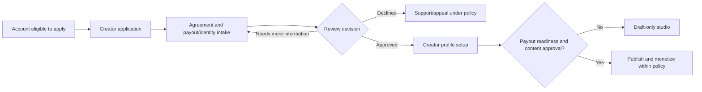

# Creator Hub — Functional Specification

**Author:** Manus AI  
**Version:** 2.0 — canonical functional specification  
**Product class:** Adult-only creator membership and media platform  
**Primary working jurisdiction:** United States federal baseline; all state, local, and international launch rules require qualified review.  
**Product constraint:** No AI content generation, AI recommendation, AI age estimation as a sole control, or AI-only moderation.

> **Working analysis, not legal or tax advice.** This specification translates compliance, safety, and product-risk considerations into functional requirements. Counsel, privacy professionals, tax professionals, and the selected payment/identity providers must approve the applicable launch implementation before production use.

## 1. Product Purpose

Creator Hub enables verified adult creators to operate professional membership spaces and enables verified, paid platform members to support and engage with those creators. The design is intentionally **membership-first**. The public site explains the service, shows approved editorial teasers, publishes safety/legal/support information, and accepts creator applications. The premium network begins only after a fan has an active **Premium Access** entitlement.

Premium Access is a platform-level paid membership, not a substitute for a creator membership, PPV purchase, live-event ticket, creator contact permission, or content entitlement. It is the first authorization gate for the premium network. Creator-specific requirements always apply cumulatively.

## 2. Product Scope

| In scope | Explicitly out of scope |
|---|---|
| Verified adult creator applications, Premium Access, creator memberships, posts, protected assets, PPV, tips, receipts, account/billing controls, messaging, follows, live-event lobby/entry, reporting, staff review, ads/sponsorship disclosure, audit records, and policy/support pages. | Any account or content involving a minor; age-bypass; anonymous creator monetization; unverified creator payouts; raw payment card data; uncontrolled public messaging; AI-generated adult content; AI-only verification or moderation; or unmoderated direct live broadcasting. |
| Provider-managed identity/age checks, payment processing, payout readiness, storage/CDN, and managed live video, subject to provider approval. | A promise that visual watermarking, URLs, or DRM eliminate all copying/screen recording. |

## 3. Users, Roles, and Account States

### 3.1 Roles

| Role | Purpose | May do | Must not do |
|---|---|---|---|
| Visitor | Public-site viewer | Read public policies/teasers; begin sign-in or creator application; contact support. | Browse real creator directory, open creator offers, view protected media, message, purchase creator access, tip, or enter live network. |
| Fan member | Adult account with Premium Access | Enter premium network; browse approved profiles; use creator offers and engagement features when creator policy and resource entitlement permit. | Act while restricted/expired; bypass creator terms, blocks, membership, PPV, ticket, or content controls. |
| Creator applicant | Account applying to become a creator | Submit application, agreements, verification, and allowed onboarding materials. | Publish, accept purchases, receive tips, or obtain ingest/payout access until approved and ready. |
| Creator | Approved verified adult creator | Manage own profile, memberships, posts, products, media metadata, eligible messages, events, creator reports, and approved payout workflow. | Access another creator’s operations/financial data; publish unapproved/restricted content; self-purchase; bypass compliance review. |
| Moderator | Assigned trust-and-safety operator | Review reports/cases and perform permitted moderation actions. | Handle payouts, alter restricted compliance evidence, or modify platform policy without additional authorization. |
| Finance operator | Assigned financial operator | Reconcile payments, refunds, chargebacks, reserves, payout exceptions, and provider status. | Change content/moderation result without separate authority. |
| Administrator | Restricted platform operator | Manage configuration, roles, policy publication, escalations, and final operations decisions. | Bypass audit/reauthentication/evidence access controls. |

### 3.2 Lifecycle states

| State | Account effect | Permitted route group |
|---|---|---|
| `pending_verification` | Identity/age/eligibility decision incomplete. | Public policy, support, verification/recovery only. |
| `active_no_premium` | Active adult account with no current Premium Access. | Public, plan/billing, support, creator application; no premium network. |
| `premium_active` | Active adult account with current Premium Access. | Premium network, subject to creator/resource rules. |
| `premium_grace` | Payment recovery period under approved policy. | Clearly defined limited access; no new purchases/tips/contact unless policy approves. |
| `premium_lapsed` | Platform plan ended/failed/canceled after grace. | Public, billing recovery, account/export/support; no premium network. |
| `creator_pending` | Fan account with creator application under review. | Premium user rights if applicable; creator onboarding only. |
| `creator_active` | Creator approved and payout-ready for selected features. | Creator workspace and permitted network actions. |
| `restricted` / `suspended` | Safety, billing, fraud, policy, or legal restriction. | Support/appeal and any mandatory records path only. |
| `closed` | Account closed under policy. | Privacy/export/support route subject to retained-record exception. |

## 4. Premium Access Policy

### 4.1 Network-gate requirement

The server shall require `premium_active` before granting a real premium-network page, API response, or action. A client-side redirect, hidden menu item, or UI watermark is not an authorization control. The application should follow least-privilege, deny-by-default, and per-request authorization principles.[1]

| Experience or action | Visitor | Signed-in, no Premium Access | Premium active | Additional condition |
|---|---:|---:|---:|---|
| Landing, policies, support, pricing | Allow | Allow | Allow | None. |
| Creator application/onboarding | Allow initiation | Allow | Allow | Age/identity/application policy applies. |
| Real creator discovery/index | Deny | Deny | Allow | Creator profile must be approved/discoverable. |
| Full creator profile and offer list | Teaser only | Teaser only | Allow | Creator visibility and block policy apply. |
| Follow/save creator | Deny | Deny | Allow | Creator/fan account active; no block. |
| Initiate/receive direct contact | Deny | Deny | Allow | Creator contact setting, relationship, rate limit, and block policy apply. |
| Creator subscription/PPV/ticket checkout | Deny | Deny | Allow | Product active; provider/payout readiness; self-purchase prevention. |
| Protected content or live playback | Deny | Deny | Conditional | Creator membership, PPV, ticket, owner/staff relationship, current resource entitlement. |
| Tip | Deny | Deny | Allow | Creator accepts tips; provider/amount/risk rules permit. |
| Creator publishing | Deny | Deny | Conditional | Creator active, policy/asset/verification status. |
| Staff operations | Deny | Deny | Conditional | Specific staff assignment, MFA/reauthentication, case scope. |

### 4.2 Premium Access purchase and recovery

| Requirement ID | Requirement | Acceptance condition |
|---|---|---|
| PA-01 | The public pricing screen shall show plan price, currency, billing cadence, material recurring terms, cancellation path, and the core network benefits before payment. | A tester can identify the recurring amount/cadence and cancel path without signing in or starting checkout. |
| PA-02 | Checkout shall be created by the server from an approved platform plan, not from a price/plan ID supplied as trusted client data. | Altering client input cannot change amount, plan, currency, or entitlement scope. |
| PA-03 | The application shall grant Premium Access only after a verified payment-provider lifecycle event is processed idempotently. | A forged success URL or browser response cannot create entitlement; repeated provider event creates no duplicate access. |
| PA-04 | The platform shall expose a customer billing-management route backed by the approved payment provider. | Account owner can view/manage recurring plan from a secure billing route. |
| PA-05 | The platform shall implement explicit `active`, `grace`, `lapsed`, `cancel_at_period_end`, `refunded`, and `disputed` mapping rules. | Test suite covers each transition and resulting gate behavior. |
| PA-06 | A lapsed or restricted user shall see a specific recovery/support path but no premium-network data. | Direct routes and APIs return a safe `PREMIUM_REQUIRED` or restriction response. |

## 5. Creator Onboarding and Verification

### 5.1 Creator application journey

### 5.2 Functional requirements

| Requirement ID | Requirement | Acceptance condition |
|---|---|---|
| CR-01 | Creator application shall collect only counsel-approved required fields, agreements, jurisdiction/eligibility selections, and verification-provider initiation data. | Standard profile fields never silently serve as a substitute for compliance evidence. |
| CR-02 | The platform shall separate ordinary profile/account data from restricted identity, age, performer-consent, and compliance evidence. | Ordinary creator-admin queries cannot retrieve restricted document contents. |
| CR-03 | Creator approval shall require an assigned review outcome, reason code, actor/time, policy version, and appeal/reapplication behavior. | Every approved/declined/restricted application is auditable. |
| CR-04 | A creator may draft profile/content settings before payout approval, but cannot publish paid products or accept funds until required eligibility/payout gates pass. | Attempts to publish/sell before readiness receive server denial. |
| CR-05 | A creator shall control display name, unique handle, profile description, public teaser, categories, discoverability, membership offer settings, content/contact settings, and audience rules within policy. | Creator edits cannot change another creator’s profile or unapproved safety/payment settings. |
| CR-06 | A creator shall have a documented re-verification/recertification pathway when a verification, agreement, evidence reference, or payout condition expires/changes. | Test fixture moves creator to restricted/draft-only state until completed. |

For covered content/workflows, the federal recordkeeping rules at 28 CFR Part 75 discuss producer responsibilities, performer name/date-of-birth records based on picture identification, indexing/cross-references, identifying references/URLs, and live Internet depictions.[2] The project must obtain counsel’s coverage analysis; the technical design requires the required evidence, index, and audit capabilities but does not determine legal coverage.

## 6. Creator Content, Products, and Media

### 6.1 Content states

| State | Meaning | Viewer behavior |
|---|---|---|
| `draft` | Creator-only working item. | Never discoverable or delivered. |
| `pending_review` | Awaiting required policy/rights/compliance review. | Creator may see status; fan cannot view. |
| `scheduled` | Approved item with future release. | Not accessible until release conditions/time. |
| `published` | Active and eligible for authorized viewing. | Exposure depends on Premium Access plus resource rule. |
| `limited` | Published with audience/territory/time/quantity restriction. | Server evaluates configured policy. |
| `removed` | Hidden due to creator action, review, rights, or safety action. | Existing links must not deliver it. |
| `archived` | No longer marketed; retained according to policy. | Viewer/creator access follows retention/access policy. |

### 6.2 Product/access types

| Type | Fan requires | Creator configures | Entitlement created |
|---|---|---|---|
| Public editorial teaser | None or public account policy | Teaser visibility | None. |
| Creator membership post | Premium Access + active creator membership | Tier(s), period, visibility | Creator membership entitlement. |
| PPV post/asset/bundle | Premium Access + verified purchase | Price/currency/product terms | Resource/bundle entitlement. |
| Live member session | Premium Access + creator membership | Schedule, eligibility, replay policy | Event/membership entitlement. |
| Ticketed live event | Premium Access + current event ticket | Ticket product, event window | Event entitlement. |
| Tip | Premium Access + active account | Tip acceptance/limits | No content entitlement unless expressly configured. |

### 6.3 Functional requirements

| Requirement ID | Requirement | Acceptance condition |
|---|---|---|
| CT-01 | All post/product pricing, entitlement type, access tier, and publication status shall be defined server-side. | Client cannot alter product price, visibility, or access category. |
| CT-02 | A protected asset shall remain private at origin; the resource request shall evaluate authorization before returning an expiring delivery credential. | A copied asset URL expires and does not authorize a different user. |
| CT-03 | Upload authorization shall be scoped to the creator, item, allowed content type/size, and a short expiration. | A fan or another creator cannot upload to the target path. |
| CT-04 | Asset metadata shall store object/provider reference, content type, size, checksum, media duration/dimensions where relevant, moderation state, and linked resource; it shall not store media bytes in relational records. | Database contains no large media BLOB used for delivery. |
| CT-05 | Creator deletion/unpublish, refund/revoke, restriction, suspension, and content removal shall prevent new media-delivery credentials immediately. | A formerly eligible viewer cannot obtain a new access URL after state change. |
| CT-06 | The UI shall display access state (public, Premium Access required, creator membership, PPV, ticket) in plain language before checkout or media request. | The fan sees the relevant requirement before payment/attempted view. |

## 7. Fan Experience and Engagement

### 7.1 Discovery and creator relationships

| Requirement ID | Requirement | Acceptance condition |
|---|---|---|
| FE-01 | The premium discovery index shall return only approved, discoverable creators to current Premium Access members. | Visitor/no-premium direct calls do not reveal real creator records. |
| FE-02 | Creator profiles shall show only fields allowed by creator/publicity setting and platform policy. | Private payout/contact/evidence fields never appear in profile response. |
| FE-03 | Follow/save actions shall be owned by the acting fan and respect blocks/restrictions. | Fan cannot create another user’s relationship or follow a blocked creator. |
| FE-04 | The library shall list only the fan’s active/currently viewable creator subscriptions, PPV/bundle access, and eligible events. | API is object-level authorized and paginated. |

### 7.2 Messaging and contact

| Requirement ID | Requirement | Acceptance condition |
|---|---|---|
| MG-01 | Only Premium Access members may initiate or participate in direct fan–creator conversations. | No-premium/lapsed account gets denial/recovery state, not a blank conversation. |
| MG-02 | Creator contact settings shall support at least `none`, `premium_members`, `subscribers_only`, and `approved_relationships_only` as policy allows. | Contact policy is evaluated server-side when creating a conversation and sending each message. |
| MG-03 | Blocks/restrictions shall be enforced in both directions across messages, follows, notifications, offers, and live chat. | A blocked account cannot use alternate client route to contact/interact. |
| MG-04 | Message APIs shall enforce participant ownership, content/payload limits, rate limits, report action, and immutable message/audit identifiers. | A user cannot retrieve/send in a guessed conversation ID. |
| MG-05 | The platform shall expose clear reporting and safety help from every message context. | A report includes conversation/message target and opens a case. |

## 8. Live Events

| Requirement ID | Requirement | Acceptance condition |
|---|---|---|
| LV-01 | A creator may schedule an event only when creator/streaming readiness is active. | Ineligible creator cannot receive ingest credentials. |
| LV-02 | The live lobby shall require Premium Access before revealing real event listings/details beyond an approved public teaser policy. | Visitor/no-premium API cannot enumerate event data. |
| LV-03 | Playback token issuance shall require Premium Access, event state/window, resource entitlement, active account, and block/restriction checks. | Valid ticket but lapsed Premium Access does not generate token. |
| LV-04 | Ingest credentials shall be creator/event scoped, short-lived/rotatable, and never returned to a fan client. | Fan endpoints cannot receive or infer ingest secret. |
| LV-05 | Live chat shall require event entry plus creator/chat policy and enforce blocks, moderation, rate limits, reporting, and audit records. | Muted/restricted user cannot continue via reconnect. |
| LV-06 | Replay shall be modeled as a separately configured resource with its own access/retention rules. | A ticket to a live session does not automatically expose replay unless product policy says so. |

## 9. Reports, Moderation, and Appeals

| Requirement ID | Requirement | Acceptance condition |
|---|---|---|
| TS-01 | Reports shall support profile, post, asset, message, live event, ad, account, copyright, billing, and high-priority safety categories. | Valid report creates a case with reporter/target/reason/status and does not expose reporter identity to target unless policy permits. |
| TS-02 | Cases shall be prioritized/routed by category, severity, content state, jurisdiction/policy tag, and staff scope. | Moderator sees only assigned/permitted cases. |
| TS-03 | Moderation actions shall include no-op/dismiss, restrict, remove, unpublish, mute, suspend, restore, require re-verification, or escalate, subject to role. | Every action records actor/time/reason/policy version and target state transition. |
| TS-04 | The platform shall maintain a restricted critical-incident path for suspected prohibited/child-safety content. | Ordinary reviewer cannot browse/download evidence; the workflow freezes access and routes to designated staff. |
| TS-05 | Account/content enforcement shall expose a support/appeal route under the approved policy without disclosing sensitive reporter or detection data. | Restricted user has a safe response and audit-linked case reference. |

NCMEC describes the CyberTipline as a centralized reporting system for online exploitation of children and notes that the public and electronic service providers can make reports of suspected online exploitation.[3] The platform must maintain a counsel-approved high-priority escalation path; it must not turn general support staff into ad hoc legal or investigative decision-makers.

## 10. Advertising and Sponsorship

| Requirement ID | Requirement | Acceptance condition |
|---|---|---|
| AD-01 | Every sponsored/paid placement shall have a sponsor/relationship field, disclosure copy, approval status, time window, placement scope, and audit record. | Unapproved/scheduled/expired campaign cannot render through normal feed/placement API. |
| AD-02 | Sponsorship disclosure shall be visible in the context of the promoted placement and legible in the site’s editorial design. | Disclosure does not rely only on color, hover, or a hidden terms page. |
| AD-03 | Behavioral/cross-context targeting shall be off by default until the privacy/consent model is approved for applicable jurisdictions. | Ad query uses consent/preference state and serves contextual/no-targeting fallback. |
| AD-04 | The platform shall never fabricate customer reviews, ratings, testimonials, or creator engagement proof. | No seeded/placeholder “reviews” are present in product, admin, or marketing surfaces. |

The FTC’s influencer/endorsement materials describe disclosure of material advertiser–endorser relationships and provide specific guidance for social media/influencer contexts.[4]

## 11. Accessibility and Editorial Design Requirements

The visual design uses matte black, restrained neon pink, Old English display type, and cursive editorial/photo captions. These treatments are brand elements—not substitutes for usable typography or functional meaning. W3C’s WCAG 2.2 describes testable accessibility success criteria and encourages use of the current version.[5]

| Requirement ID | Requirement | Acceptance condition |
|---|---|---|
| UX-01 | The conformance target shall be WCAG 2.2 AA unless a more specific legal/contractual standard applies. | Automated and manual test results are documented for release. |
| UX-02 | Old English/cursive typography is permitted only in large display/caption contexts; material terms, instructions, legal copy, inputs, errors, prices, consent, and safety notices use readable sans-serif text. | A tester can complete onboarding, checkout, reporting, and account recovery without relying on decorative type. |
| UX-03 | All access state is communicated with text and not only color/icon. | Premium required, purchase required, error, restriction, and safety states are read aloud and visually distinct. |
| UX-04 | Video/live interfaces provide the relevant captions, transcript/media alternative, controls, keyboard support, and focus behavior required by policy/accessibility target. | Keyboard-only and screen-reader test scripts pass. |
| UX-05 | Age/identity, subscription, cancellation, and support routes are direct, readable, mobile responsive, and do not rely on obscured focus/drag-only gestures. | Core path is completed at mobile/desktop target breakpoints. |

## 12. End-to-End Acceptance Journeys

| Journey | Minimum acceptance path |
|---|---|
| J-01: Visitor to Premium member | Visitor reads terms/pricing → signs in → completes eligibility/age path → selects server-defined plan → provider completes payment → verified webhook creates `premium_access` → user enters discovery. |
| J-02: Lapsed member | Provider failure/end event → entitlement moves to grace/lapsed per policy → direct premium route/API denies data → member sees billing recovery → verified recovery event restores access idempotently. |
| J-03: Creator onboarding | Eligible account applies → submits required agreements/verification → staff decision is audited → creator creates profile/draft → payout/creator readiness approval → publish/monetize features activate. |
| J-04: Creator PPV purchase | Premium fan views authorized creator offer → server validates product/creator/no self-purchase → approved adult-industry provider checkout → verified event → resource entitlement → short-lived asset access. |
| J-05: Message request | Premium fan requests conversation → server checks Premium Access, creator contact setting, blocks, account states/rate limit → creates/reuses conversation → message report is available. |
| J-06: Live entry | Premium fan opens event lobby → checks platform entitlement + creator/ticket/membership + event window → server issues expiring playback token → chat applies per-message policy. |
| J-07: Report action | User reports resource → case with correct target created → moderator sees role-scoped queue → disposition changes resource/account state → action is audit-recorded and appeal path is offered if policy requires. |
| J-08: Copyright notice | Authorized claimant uses policy route → case captures qualifying notice fields → target resource can be located → staff action/status recorded → policy governs creator notice/counter-notice/escalation. |

## References

[1]: https://cheatsheetseries.owasp.org/cheatsheets/Authorization_Cheat_Sheet.html "OWASP Authorization Cheat Sheet"
[2]: https://www.ecfr.gov/current/title-28/chapter-I/part-75 "eCFR — 28 CFR Part 75"
[3]: https://www.missingkids.org/gethelpnow/cybertipline "NCMEC — CyberTipline"
[4]: https://www.ftc.gov/business-guidance/advertising-marketing/endorsements-influencers-reviews "Federal Trade Commission — Endorsements, Influencers, and Reviews"
[5]: https://www.w3.org/TR/WCAG22/ "W3C — Web Content Accessibility Guidelines 2.2"
