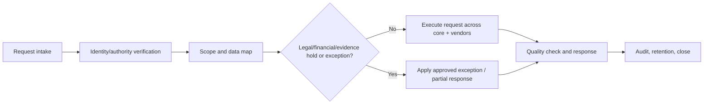

# Creator Hub — Governance, Operations, Testing, and Launch Specification

**Author:** Manus AI  
**Version:** 2.0 — canonical operations and launch specification  
**Applies to:** Premium Access, creator onboarding, content/media, purchases, payouts, messaging, live events, advertising, trust and safety, privacy, and staff operations.

> **Working implementation specification, not legal/tax advice.** The platform must not launch an adult-entertainment experience until qualified counsel, privacy professionals, tax professionals, insurers, and each selected provider have approved the actual jurisdiction, business model, policies, and operational controls.

## 1. Governance Model

### 1.1 Governing principles

The platform shall operate through documented policies, defined decision authorities, evidence-based workflows, and traceable records. Commercial urgency, creator status, user relationship, or staff seniority shall not override eligibility, safety, privacy, payment-provider, or critical-incident controls without a documented and authorized escalation decision.

| Principle | Required practice |
|---|---|
| Lawful-by-design | Map each launch jurisdiction, content/transaction type, and audience to a counsel-approved obligation/control register before enabling it. |
| Verification before access | Premium Access, creator activation, protected media, payout availability, and live entry are enabled only from server-verified current states. |
| Least privilege | Staff capabilities are separately assigned, case-scoped where feasible, and reviewed/revoked on role change. |
| Human accountability | Material creator approval, enforcement, payment/payout exception, and critical-incident decisions have a responsible human owner and auditable rationale. |
| Data minimization | Collect only approved fields; segregate restricted evidence; retain/erase according to approved policy/holds. |
| Provider eligibility | Payment, identity, storage, video, and communications providers are activated only after written approval for the actual adult-entertainment use case. |
| No fabricated social proof | The platform shall not create or display fabricated ratings, reviews, testimonials, purchase counts, user activity, creators, or engagement. |

### 1.2 Decision authority

| Decision | Accountable owner | Required reviewer/approver | Record generated |
|---|---|---|---|
| Launch jurisdiction and content-policy scope | Executive owner | Qualified counsel, privacy, tax, payment-provider/commercial owner | Jurisdiction/obligation register; signed launch approval. |
| Adult-industry payment/acquiring provider activation | Finance owner | Counsel, security, provider underwriting/contract owner | Provider eligibility matrix; contract/approval reference; capability date. |
| Creator approval / re-verification | Creator operations owner | Assigned reviewer; compliance reviewer when triggered | Application decision, policy version, reviewer, evidence reference. |
| Content removal/restriction | Trust-and-safety owner | Moderator; escalation owner for high severity | Case/action/audit record. |
| Critical child-safety or legal incident | Incident owner | Designated executive/legal/escalation personnel | Restricted incident record and preservation/escalation log. |
| Refund, chargeback, reserve, payout exception | Finance owner | Provider/finance reviewer; support/trust-safety input as applicable | Ledger adjustment and case record. |
| Privacy request | Privacy owner | Counsel/security as necessary | Request, identity-verification, response, exception/hold record. |
| Sponsored campaign approval | Advertising owner | Compliance/trust-safety review | Sponsorship disclosure, consent, approval/audit record. |

## 2. Policy Library and Public Pages

The public policy/support area remains accessible without Premium Access. A person must be able to understand eligibility, recurring-billing terms, cancellation/support path, prohibited content, reporting, privacy options, copyright/DMCA process, and contact information before or without entering the premium network.

| Policy / page | Minimum content | Owner | Release control |
|---|---|---|---|
| Terms of Service | Eligibility, account rules, Premium Access, creator/fan terms, content/license, billing/cancellation, restrictions, dispute/support, policy changes. | Legal/product | Version/date/acceptance event required. |
| Community & Creator Content Standards | Prohibited/restricted content, consent/authenticity, moderation, appeals, contact/live/chat rules, creator obligations. | Trust & Safety / Legal | Staff playbook maps each rule to action. |
| Creator Agreement | Representations, grants, content eligibility, evidence/verification cooperation, payout/fees, tax responsibilities, enforcement/termination. | Legal / Creator Ops | Version/date/affirmative acceptance required. |
| Premium Access terms | Price/currency/cadence, renewal, cancellation, grace/recovery, benefit boundary, refund/support rules. | Product / Legal / Finance | Checkout disclosure and receipt must reference current version. |
| Privacy Notice & rights | Categories/purposes/vendor sharing/retention/rights methods/consent or opt-out/appeal, as applicable. | Privacy | Jurisdiction/version activation check. |
| Copyright / DMCA | Agent details after valid designation, notice/counter-notice process, repeat-infringer policy, escalation contact. | Legal / Trust & Safety | Case workflow and policy details consistent. |
| Safety & reporting | Report paths, emergency limitation, support/escalation, account blocking, prohibited-content statement. | Trust & Safety | Available on profile/post/message/live surfaces. |
| Advertising / sponsorship | Labeling rules, sponsor disclosure, targeting/consent, prohibited claims. | Advertising / Legal | Placement serving rejects unapproved status. |

The U.S. Copyright Office states that certain service providers seeking DMCA safe-harbor protection must designate an agent, make specified agent information publicly available, and provide it to the Office. Its page also describes notice elements and expeditious removal/disable expectations after a qualifying notice.[1] Counsel must determine the platform’s actual obligations and policy wording.

## 3. Staff Operations

### 3.1 Operational queues

| Queue | Primary users | Input | Required actions | Service-level configuration |
|---|---|---|---|---|
| Creator applications | Creator operations, compliance | Application, verification/payout/agreements status | Request info, approve, decline, restrict, reverify. | Jurisdiction/risk-configured; no undocumented automatic approval. |
| Content review | Creator ops, moderation | Post/asset/live metadata, report, compliance flags | Allow, limit, age/territory restrict, remove, escalate. | Severity-based; publishing state blocks delivery while unresolved. |
| User report / contact abuse | Moderation | Profile/post/asset/message/live/ad report | Triage, context review, warn/mute/block/suspend/remove, escalate. | High/critical queue first; reporter confidentiality controls. |
| Critical incident | Designated restricted response team | High-priority safety signal | Freeze, preserve, restrict access, designated escalation, legal direction. | Immediate; separate evidence and case access. |
| Payment/customer support | Finance/support | Checkout/subscription/payment/refund/dispute issue | Reconcile provider, correct entitlement, refund/cancel per approved policy, escalate. | Provider event is authoritative for payment result. |
| Payout/creator finance | Finance | Creator balance/payout readiness/reserve/tax status | Reconcile, hold/release per rule, create batch/adjustment, escalate. | No payout release without provider/readiness/hold checks. |
| Copyright notices | Legal/trust & safety | Notice/counter-notice, target reference | Validate intake, locate/disable/notify/escalate/retain records. | Counsel-defined timelines and case routing. |
| Privacy rights | Privacy/support | Access/delete/correct/opt-out/limit request | Verify request, locate records/vendors, act/deny/exception, respond, audit. | Jurisdiction/legal-hold-aware deadline calendar. |
| Sponsorship approval | Advertising/compliance | Campaign/sponsor/disclosure/targeting request | Approve/reject/expire, set label, restrict audience. | Cannot serve without current approval/consent rule. |

### 3.2 High-impact action controls

The following actions must require step-up authentication, reason code, mandatory audit, and a confirmation screen that identifies the scope and effect: permanent account suspension; creator deactivation; delete/disable content; change payout/settlement status; issue material refund/adjustment; view restricted evidence; change staff role; modify retention/hold; publish policy; and enable/disable provider capability.

| Action type | Required assurance | Dual control | Minimum audit data |
|---|---|---|---|
| Emergency access freeze | MFA + designated incident role | Optional post-action review if time-critical | actor, target, trigger, time, scope, next-review time. |
| Content removal/account restriction | MFA for broad/high impact | Required for permanent/appeal-sensitive actions as policy defines | actor, case, policy, rationale, before/after, notification decision. |
| Payout/refund/ledger adjustment | MFA + finance role | Required over policy threshold or manual hold release | actor, provider refs, amount/currency reference, reason, approvals. |
| Evidence access/export | MFA + case-scoped grant | Required approval except predesignated emergency path | requester, approver, case, purpose, time-bounded grant, access event. |
| Staff access/policy configuration | MFA + reauth | Required for admin/production configuration | actor, configuration diff/version, approver, environment. |

## 4. Financial Operations and Provider Controls

### 4.1 Provider selection/activation gate

The product must remove the assumption that a generic payment provider can process the proposed adult-entertainment transactions. The currently researched Stripe policy lists adult services, including pay-per-view and adult live-chat features, within prohibited business categories.[2] Consequently, the existing Stripe integration is a non-production technical prototype and must remain disabled for the adult-content payment flow unless the provider gives written approval for the exact use case and jurisdiction.

| Provider-approval evidence | Required before production activation |
|---|---|
| Business-model acceptance | Written confirmation that the provider/acquirer accepts the actual adult content/service, Premium Access, recurring creator memberships, PPV, tips, live access, refunds/chargebacks, and the selected merchant-of-record/payout model. |
| Jurisdiction/currency support | Approved countries/states, currencies, sanctions/blocked geographies, tax/settlement conditions. |
| Creator settlement model | Whether platform/creator is seller/merchant, connected account/sub-merchant structure, KYC, reserve, hold, payout schedule, return/refund responsibility. |
| Compliance operations | Required creator/evidence/descriptor/cancellation/refund/customer support disclosures, monitoring/review, and reporting. |
| Security integration | Hosted checkout/tokenization approach, webhook signature/replay contract, IP allowlist/verification guidance, sandbox, incident contact, retention/contract exit. |
| Financial risk | Chargeback monitoring, negative-balance/reserve policy, velocity/limits, dispute evidence workflow, notification/escalation. |

### 4.2 Ledger and reconciliation

| Requirement ID | Requirement | Acceptance condition |
|---|---|---|
| FIN-01 | The platform shall create an immutable business ledger entry for a verified financial event or authorized internal adjustment. | No API can update a posted amount; correction creates a compensating entry. |
| FIN-02 | A provider event shall be unique by provider/event identifier and processed idempotently. | Replayed webhook produces no duplicate entitlement, order, payout, or ledger entry. |
| FIN-03 | The platform shall reconcile payment/subscription/chargeback/refund/payout statuses with the approved provider on a documented interval and exception queue. | A discrepancy appears in the reconciliation queue with owner/status. |
| FIN-04 | Creator payable amount shall be derived from approved revenue/fee/refund/reserve/adjustment entries, not a mutable UI counter. | Statement total is traceable to ledger references. |
| FIN-05 | Payout shall require creator eligibility, payout-provider readiness, no relevant hold/restriction, approved schedule, and required approver controls. | Payout request fails safely if any prerequisite changes. |
| FIN-06 | Subscription cancellation, refund, decline, dispute, recovery, and grace behavior shall be visible to the entitled user and audited. | Test suite verifies gate result/copy for each lifecycle event. |

PCI Security Standards Council describes PCI DSS as baseline technical and operational requirements for environments that store, process, or transmit payment account data, and notes that encryption alone may not remove an environment from scope.[3] Creator Hub must keep raw card data out of its system, use provider-approved hosted/tokenized collection, and obtain a provider/acquirer-confirmed PCI scope and validation plan.

## 5. Privacy, Data Lifecycle, and Rights Operations

### 5.1 Classification

| Data class | Examples | Default handling |
|---|---|---|
| Public approved profile data | Handle, display name, public teaser/category per creator setting. | Display only to entitled/audience-authorized query; no restricted identity values. |
| Confidential account/commercial data | Email, billing references, subscriptions, receipts, creator sales. | Authenticated owner/staff-need-to-know access; encrypted in transit/at rest; redacted in logs. |
| Sensitive interaction/activity data | Message content, viewing/purchase events, blocks/reports, location where collected. | Purpose-limited collection; strict role/case access; retention/rights mapping. |
| Restricted identity/evidence data | Age/identity/consent/performer/compliance documents and indexes. | Separate vault, encrypted, time/case-scoped access, heightened audit/hold retention. |
| Security/financial audit data | Authentication, provider event, ledger, staff action, access grant. | Append-only/auditable; retention governed by legal/financial/security policy. |

The California DOJ’s CCPA overview identifies, for covered businesses, rights to know, delete subject to exceptions, correct, opt out of sale/sharing, and limit certain sensitive information use/disclosure. It includes information concerning sex life/sexual orientation among examples of sensitive personal information.[4] This platform must handle related information as sensitive by design, while counsel determines actual applicability and final notices/rights process.

### 5.2 Rights-request workflow

| Requirement ID | Requirement | Acceptance condition |
|---|---|---|
| PR-01 | The platform shall provide the approved request intake methods and avoid requiring Premium Access to exercise an applicable privacy right. | Public support/privacy route reaches a request form/process. |
| PR-02 | Each request shall be verified proportionately, scoped, tracked, and associated with response deadline/escalation policy. | Staff queue shows owner/status/deadline without exposing unrelated evidence. |
| PR-03 | Deletion/export/correction/opt-out/limit actions shall resolve core records and approved provider/vendor instructions as legally/policy appropriate. | Test scenario shows completion/exception state and provider task/reference. |
| PR-04 | The system shall document and apply legal, financial, security, safety, and restricted-evidence retention/hold exceptions. | A legal hold blocks unsafe routine deletion and records authority. |
| PR-05 | Advertising/analytics data access shall evaluate consent/preference/GPC policy before targeted sharing/processing. | Request or preference changes placement/analytics behavior as configured. |

## 6. Safety, Moderation, and Critical Incident Operations

### 6.1 Standard report lifecycle

| State | Meaning | Required control |
|---|---|---|
| `received` | Report is accepted. | Timestamp, target linkage, duplicate detection, reporter-protection flag. |
| `triaged` | Severity/queue/routing chosen. | Priority/reason/case owner; no unauthorized staff visibility. |
| `in_review` | Assigned staff working case. | Access/audit, evidence reference, conflict/recusal handling. |
| `actioned` | Action applied or no-action decision. | Rationale, policy version, before/after state, notifications/appeal eligibility. |
| `appeal_pending` | Subject challenge accepted under policy. | Independent/authorized reviewer and protected original record. |
| `closed` | Workflow complete. | Retention clock, follow-up/review actions, audit preserved. |

### 6.2 Critical incident path

> **Critical incident rule:** staff must not download, redistribute, or investigate restricted material beyond the approved role/runbook. They must contain, preserve references, and escalate to designated personnel under counsel-approved procedures.

| Trigger class | Immediate technical action | Operations action |
|---|---|---|
| Suspected prohibited child-safety content/enticement/exploitation | Stop upload/publish/delivery/stream and affected contact paths; restrict account/resource; preserve tamper-evident reference in restricted case domain. | Notify designated response owner; follow counsel-approved preservation/reporting/escalation plan. |
| Non-consensual/intimate-image allegation or identity/consent dispute | Disable new public/protected delivery as policy requires; preserve relevant history/references; protect reporter/subject privacy. | Triage under dedicated case type; apply legal/safety escalation and creator account controls. |
| Credible threat, coercion, extortion, doxxing, or stalking signal | Limit contact/discovery/notifications; preserve reports and safety context; no public disclosure. | Escalate to designated safety/legal team and emergency protocol where applicable. |
| Account takeover/payment fraud | Freeze payment/contact/payout/credential changes as risk policy dictates; revoke sessions/tokens. | Security investigation, user support/recovery, provider notification/reconciliation. |
| Live safety incident | End/mute/restrict stream/chat/entry as authority permits; retain provider state/audit reference. | Open incident case; protect evidence and notify appropriate owners. |

NCMEC describes the CyberTipline as a centralized reporting system for online exploitation of children, available to the public and electronic service providers for suspected online exploitation reports.[5] Exact reporting duties and handling must be set by qualified counsel and assigned operators; this specification ensures the product has a controlled path to act without broad, unsafe evidence access.

## 7. Advertising and Promotional Governance

| Requirement ID | Requirement | Acceptance condition |
|---|---|---|
| GOV-AD-01 | Every sponsorship/ad shall be linked to sponsor identity/relationship, copy/creative version, audience/placement, time window, disclosure text, and approval. | Server query returns only approved, current, consent-eligible placements. |
| GOV-AD-02 | Promotional disclosure shall be visible, clear, and accessible in the same context as the placement. | Keyboard/screen reader/mobile test can perceive the disclosure without opening a separate policy page. |
| GOV-AD-03 | The advertising system shall prevent sponsored placement against prohibited/restricted content, audiences, or jurisdictions as configured. | Rule engine rejects incompatible campaign target. |
| GOV-AD-04 | Consent/preference state shall be preserved and used for relevant targeting/sharing decisions. | Opt-out yields a contextual or no-ad fallback according to policy. |
| GOV-AD-05 | No customer reviews, ratings, testimonials, creator popularity counts, or promotional claims are seeded or fabricated. | Content-review query/test identifies no synthetic user-generated endorsement. |

The FTC’s influencer/endorsement materials explain that material relationships between endorsers and brands should be disclosed and provide guidance for social-media/influencer contexts.[6]

## 8. Testing and Quality Program

### 8.1 Test matrix

| Layer | Required test focus | Examples |
|---|---|---|
| Unit | Pure policy, lifecycle, validation, mappings | `requirePremiumAccess`; expiration/grace; ownership; self-purchase; block; plan/product selection; provider event idempotency key. |
| Integration | Domain router + DB + provider adapter fake | Premium checkout cannot use client price; verified event grants once; restriction revokes delivery; privacy hold overrides deletion. |
| API/security | Authorization, input, object access, rate/csrf/session/provider callback | IDOR/BOLA attempts; session fixation; webhook replay/bad signature; malicious upload metadata; log redaction. |
| End-to-end | Full supported user journeys | Visitor-to-premium; creator review-to-publish; purchase-to-library; lapsed-to-recovery; report-to-action; ticket-to-live lobby. |
| Accessibility | Automated + manual WCAG 2.2 AA testing | Keyboard, focus, zoom/reflow, labels/errors, contrast, screen reader, media controls, accessible authentication. |
| Performance/resilience | Load/failure/retry | Premium gate under load; provider outage; webhook delay/replay; stream-provider failure; CDN token expiration. |
| Privacy/operations | Procedure tests | Rights request, legal hold, audit search, evidence-grant expiry, campaign consent. |
| Pre-production | Penetration test, configuration review, backup/restore, incident tabletop | Third-party security review and signed risk exceptions. |

### 8.2 Release blocking tests

| Blocker ID | Production promotion must fail when |
|---|---|
| RB-01 | Any nonpremium visitor/account can enumerate real premium creators, offers, messages, products, events, or protected asset metadata. |
| RB-02 | Protected media/playback works with a copied or expired credential, no current entitlement, restriction, or wrong owner. |
| RB-03 | Payment/webhook integration uses an unapproved processor, raw card data touches application code/logs, or event verification/idempotency fails. |
| RB-04 | Creator can publish/monetize without required current verified/approved/payout-ready states. |
| RB-05 | Staff can access restricted evidence or high-impact actions without assigned scope, MFA/reauthentication, audit, and required approval. |
| RB-06 | Critical safety path fails to freeze delivery/entry/contact or produces broad/unsafe evidence access. |
| RB-07 | Policy/legal/support/privacy/rights/cancellation paths are unavailable to public/nonpremium users. |
| RB-08 | Critical user journeys fail WCAG target validation or materially rely on decorative typography/color alone. |
| RB-09 | A documented legal, privacy, payment-provider, tax, or insurance launch sign-off is missing for the actual rollout. |

W3C describes WCAG 2.2 as a Recommendation with testable success criteria and explicitly encourages use of the current version when building or updating web accessibility policies.[7]

## 9. Production Readiness Checklist

| Workstream | Exit evidence |
|---|---|
| Jurisdiction/legal | Counsel-approved launch matrix, terms/policies, content/eligibility/records analysis, consumer/cancellation/refund/advertising/copyright paths, designated incident contacts. |
| Payments/payouts | Written adult-industry processor/acquirer approval, signed commercial/underwriting plan, sandbox test evidence, webhook/reconciliation/dispute/reserve/runbook, provider production activation. |
| Identity/creator evidence | Approved verification vendors, data-processing/security review, creator application/review/reverification controls, restricted evidence architecture and access tests. |
| Security | Threat model, access-control regression results, secrets/config review, dependency/security scan, pen-test/remediation/risk sign-off, logging/alerting, backups/restore test. |
| Privacy | Data map, notices, rights workflow, vendor contracts/DPA as applicable, retention/hold schedule, consent/opt-out/GPC design, privacy incident process. |
| Safety/operations | Policy/playbooks, staffed queues/coverage, escalation/case/evidence controls, tabletop exercises, appeal/restriction workflow, customer-support scripts. |
| Content/live | Storage/CDN/video provider approval, token/ingest controls, live moderation coverage, accessible media plan, incident-stop control test. |
| Quality | All RB blockers pass, acceptance journeys signed off, mobile/browser/accessibility test artifacts, performance/failure test evidence. |
| Commercial | Merchant descriptor/support channel, creator statement/settlement design, accounting export/reconciliation, tax/reporting review, insurance/risk review. |

## 10. Handoff and Operational Artifacts

| Artifact | Audience | Update cadence |
|---|---|---|
| Architecture decision record | Engineering/security/product | Per material design/provider change. |
| Jurisdiction/obligation register | Legal/privacy/operations | Before every regional/content/payment expansion. |
| Provider eligibility matrix | Finance/security/legal/engineering | Contract renewal, policy change, new transaction type. |
| Creator review playbook | Creator operations/compliance | Policy/verification change. |
| Moderation and critical incident runbooks | Trust & Safety/on-call/legal | Quarterly/tabletop and every incident. |
| Payment and payout reconciliation SOP | Finance/support | Provider/product lifecycle change. |
| Privacy rights and retention schedule | Privacy/support/engineering | Jurisdiction/vendor/policy change. |
| Security test and release report | Engineering/security/executive | Every production release; formal review at least per risk policy. |
| Accessibility conformance/test report | Product/design/engineering | Every material UI release. |

## References

[1]: https://www.copyright.gov/dmca-directory/ "U.S. Copyright Office — DMCA Designated Agent Directory"
[2]: https://stripe.com/en-th/legal/restricted-businesses "Stripe — Prohibited and Restricted Businesses"
[3]: https://www.pcisecuritystandards.org/merchants/ "PCI Security Standards Council — Merchant Resources"
[4]: https://oag.ca.gov/privacy/ccpa "California Department of Justice — California Consumer Privacy Act"
[5]: https://www.missingkids.org/gethelpnow/cybertipline "NCMEC — CyberTipline"
[6]: https://www.ftc.gov/business-guidance/advertising-marketing/endorsements-influencers-reviews "Federal Trade Commission — Endorsements, Influencers, and Reviews"
[7]: https://www.w3.org/TR/WCAG22/ "W3C — Web Content Accessibility Guidelines 2.2"
