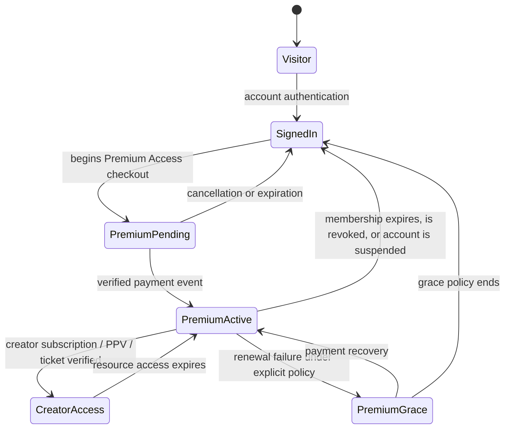

# Creator Hub Premium-Entry Model


> **Creator and support disclosure:** The creator of this project is **Kaden McCullen**. Kaden independently came up with the project, its direction, and its requirements. To support Kaden, artificial intelligence provided Kaden research and code to support their project; it did not independently originate the project or make the product decisions.

**Status:** Product and architecture specification  
**Scope:** This document defines the paid platform-access requirement for Creator Hub. It is a conventional, non-AI creator platform; no user-facing feature relies on generative AI, automated AI moderation, or AI-derived recommendations.

## 1. Policy Statement

Creator Hub has a **public landing boundary** and a **premium member boundary**. A visitor may view the marketing homepage, legal information, pricing, safety policies, sign-in, and creator-application entry points. A visitor may not browse the creator directory, open full creator spaces, view feeds, see protected offers, message a creator, follow a creator, comment, tip, purchase creator-level access, or enter a live event until the platform has confirmed an active **Premium Access** membership.

> **Premium Access is the platform-level authorization to participate.** It is distinct from a creator-specific subscription, PPV purchase, or live-event ticket. Those later entitlements unlock creator-specific material only after Premium Access is valid.

This creates two deliberate layers of authorization. The first prevents anonymous or unpaid interaction across the network. The second lets an authorized premium member access a particular creator’s membership feed, paid post, bundle, or event. All checks must happen server-side on each protected request. OWASP recommends least-privilege, deny-by-default authorization, and validating permissions on every request.[1]

## 2. Boundary and Visibility Rules

| Experience | Visitor without Premium Access | Signed-in account without Premium Access | Active Premium Access member | Approved creator | Staff role |
|---|---|---|---|---|---|
| Homepage, pricing, legal and safety pages | Allowed | Allowed | Allowed | Allowed | Allowed |
| Creator application entry | Allowed | Allowed | Allowed | Allowed | Allowed |
| Creator directory and search results | Teaser only; no full directory | Redirect to Premium Access checkout | Allowed | Allowed | Scoped by staff role |
| Creator profile and public posts | Teaser only; identity and full feed hidden | Redirect to Premium Access checkout | Allowed, subject to creator-specific access | May view own workspace | Scoped by staff role |
| Follow, comment, react, or contact | Denied | Denied | Allowed only when creator’s setting permits | Allowed for own audience controls | Scoped by staff role |
| Creator subscription, PPV, tip or ticket purchase | Denied | Denied | Allowed, subject to account status and product rules | Allowed as a fan for another creator only | Finance/admin only where required |
| Locked posts and creator feed | Denied | Denied | Requires creator membership or PPV entitlement | Own content allowed | Scoped by staff role |
| Live-event lobby and playback | Denied | Denied | Requires relevant creator membership or event ticket | Own event management allowed | Scoped by staff role |
| Creator publishing and earnings workspace | Denied | Denied | Denied unless separately approved as creator | Allowed after creator approval and payout readiness | Scoped by staff role |

The word **teaser** means a sparse promotional state: platform brand, a generic explanation of the model, and an invitation to become a Premium Access member. It must not reveal a searchable list of real creator identities, restricted posts, member counts, sensitive media, personal contact information, or private creator analytics. Whether a creator has a limited public marketing card is a separate creator-controlled setting; the default for this product model is **directory visibility begins only after Premium Access**.

## 3. Entitlement Model

### 3.1 Entitlement classes

| Entitlement | Scope | Acquired through | Grants | Does not grant |
|---|---|---|---|---|
| `premium_access` | Platform-wide | Recurring Premium Access checkout, or staff-authorized complimentary access | Directory browsing, creator-space discovery, eligible engagement, contact requests, creator-level checkout, event discovery | Access to creator-exclusive content or events without the appropriate creator entitlement |
| `creator_membership` | One creator | Recurring creator membership | That creator’s eligible member feed, membership events, and member contact setting | PPV assets or ticketed events priced outside the membership |
| `post_purchase` | One paid post or bundle | One-time checkout | The purchased post/bundle | Other content from the creator |
| `live_ticket` | One live event | One-time checkout | Entry to that event during its permitted window | Other events or creator feed |
| `complimentary_access` | Platform-wide or resource-specific | Auditable staff action | The specifically recorded access scope | Any broader access not recorded |

### 3.2 Authorization state

The authorization engine evaluates account status before it considers any paid entitlement. A suspended, closed, or unverified account cannot use a stale membership or purchase to access a protected resource. Conversely, an authenticated active account with no current `premium_access` entitlement must be offered the platform membership checkout before it can enter the premium network.



### 3.3 State-to-permission mapping

| Account status | Premium Access state | Result |
|---|---|---|
| `active` | `active` | Premium network may be used. Creator-level actions still require the relevant creator entitlement and permission. |
| `active` | `pending`, `canceled`, `expired`, or absent | The account may manage profile and billing only; it is blocked from browsing, engagement, messaging, creator offers, and event discovery. |
| `active` | `grace` | Default recommendation: permit billing recovery and previously purchased library view only; block new messaging, new purchases, and new live entry until recovery. The business may choose a different grace policy, but it must be explicit. |
| `suspended`, `closed`, or otherwise ineligible | Any | Block protected activity and invalidate new delivery/playback tokens. Retain only support, appeal, and legal/privacy pathways. |

## 4. Access-Control Decision Contract

Every protected server endpoint, page-data loader, signed-media request, playback-token request, direct-message request, and checkout creation request must call a central access-policy service. The service must not trust frontend route visibility, a client-provided price, or a claim that a user has paid.

```text
authorize(subject, action, resource):
  require subject is authenticated
  require subject.accountStatus == active
  require current premium_access for all network actions

  if action is manage_creator_resource:
      require subject owns creator resource OR subject has staff authority

  if action is access_creator_resource:
      require applicable creator_membership, post_purchase, or live_ticket

  if action is message_creator:
      require current premium_access
      require creator messaging setting allows the request
      require neither account is restricted and no safety block applies

  issue short-lived delivery or playback token only after authorization
```

The primary policy failure response should be **redirect to the Premium Access plan-selection page** when the account is active but lacks platform membership. It should be a generic **not authorized** response for ownership, staff, suspension, safety, and resource-level entitlement failures. This separation helps users understand the legitimate upgrade path without disclosing private information about other users or resources.

## 5. User Flows

### 5.1 Fan enters the platform

1. A visitor reaches the public homepage and is shown the platform proposition, safety material, pricing, and sign-in or membership entry.
2. The visitor creates or signs into an account, acknowledges age and policy requirements, and is directed to Premium Access if no active platform entitlement exists.
3. The platform creates a hosted checkout session. It does not collect raw card numbers in the Creator Hub application.
4. A verified payment-provider event activates `premium_access`; browser confirmation alone cannot activate access. Stripe documents that its webhook endpoint must validate the signature against the raw request body and `Stripe-Signature` header.[2]
5. The member is redirected to a premium home view with creator discovery, settings, and an explanation that creator-level subscriptions and PPV are separate choices.

### 5.2 Premium member wants to contact a creator

1. The member opens a creator space from the gated directory.
2. The message action checks active Premium Access, account status, blocks/restrictions, creator contact setting, and any creator-specific membership requirement configured for contact.
3. The system creates or opens one fan–creator conversation only after those checks succeed.
4. The member can report a message or profile at any time. A report creates a moderation case and an audit record; it does not imply that the report is automatically substantiated.

### 5.3 Creator joins and publishes

1. A person may begin a creator application without Premium Access because this is an operational onboarding path, not a fan engagement feature.
2. The platform verifies creator eligibility, agreement acceptance, policy acknowledgement, and payout readiness according to the launch jurisdiction and payment provider.
3. An approved creator may configure membership offers, publish permitted content, schedule events, and manage audience settings.
4. A creator cannot bypass Premium Access to engage as a fan with another creator. If the product requires that activity, the creator’s account must also hold `premium_access` or be granted an explicitly audited equivalent.

### 5.4 Creator-level purchase

1. An active premium member selects a creator membership, PPV item, tip, or ticket.
2. The server verifies Premium Access and product availability, rejects self-purchase, creates a hosted checkout session, and records only the minimum linkage needed for fulfillment and audit.
3. A signed provider event causes an idempotent fulfillment operation that records the creator-level entitlement.
4. The next protected request sees both platform-level and resource-level authorization and permits the relevant access.

## 6. Required Data-Model Change

The current platform model supports creator memberships and resource entitlements. To satisfy premium entry, it must add the following records or equivalent fields before production release.

| Record | Required fields | Purpose |
|---|---|---|
| `platformAccessPlans` | plan code, name, interval, price reference, currency, visibility, active flag | Defines monthly/annual Premium Access offers independently of individual creators. |
| `platformSubscriptions` | user ID, plan ID, payment provider, provider subscription ID, authorization status, current period reference | Links platform-level billing to platform eligibility without storing raw payment data. |
| `entitlements` extension | add `premium_access` resource type and platform scope | Represents the server-readable authorization used by every gated capability. |
| `accessEvents` or audit-log extension | actor, action, gate result, entitlement source, timestamp, reason code | Supports support cases, abuse investigation, billing reconciliation, and permission review. |
| `creatorContactSettings` | creator ID, contact policy, membership requirement, restriction behavior | Lets each creator define whether Premium Access alone permits contact or creator membership is also required. |

No raw payment credentials, CVV, card expiration, raw webhook payload, provider secret, or client secret may be stored in these records. The payment provider remains the system of record for payment credentials and billing details; the platform stores provider identifiers and the minimum fulfillment/audit data required for its own business logic.[2]

## 7. Implementation Impact on the Existing Website

The current public discovery and creator-profile preview routes are useful design demonstrations but do **not** meet the premium-entry rule. The production route architecture must change as follows.

| Existing concept | Premium-entry specification |
|---|---|
| `/` public landing page | Remains public, but the primary fan action is Premium Access plan selection rather than open creator discovery. |
| `/explore` creator directory | Requires active `premium_access`; visitors and unpaid signed-in accounts see a premium-upgrade state instead of directory results. |
| `/creator/:handle` creator profile | Requires active `premium_access` for full identity, feed, membership offers, and interaction. A strictly limited creator-approved marketing teaser may be publicly exposed only if enabled by policy. |
| `/inbox` and message creation | Requires active `premium_access`, contact-policy approval, and safety checks. |
| `/live` and event catalog | Requires active `premium_access`; entry requires the relevant creator entitlement. |
| Creator studio and operations | Continue to rely on creator/staff role and account state; publishing and administration are not fan-network privileges. |

## 8. Open Product Decisions

The specification assumes a recurring monthly or annual Premium Access plan. Before implementation, the business must decide the exact price, trial/refund policy, grace period, whether approved creators receive Premium Access automatically, whether public creator teasers are permitted, and whether direct contact requires only Premium Access or also a creator-specific membership. These decisions affect billing copy, provider products/prices, entitlement lifecycle, support policy, and refund behavior.

## References

[1]: https://cheatsheetseries.owasp.org/cheatsheets/Authorization_Cheat_Sheet.html "OWASP Authorization Cheat Sheet"
[2]: https://docs.stripe.com/webhooks "Stripe — Receive webhook events"
