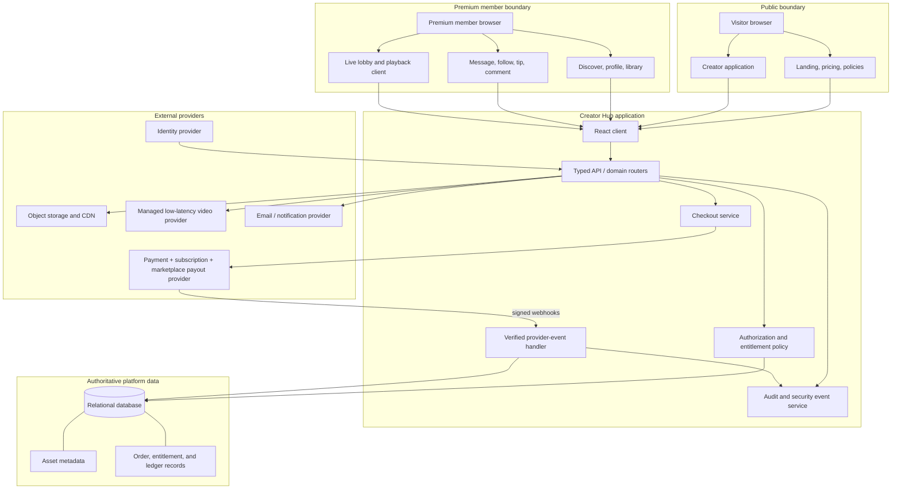
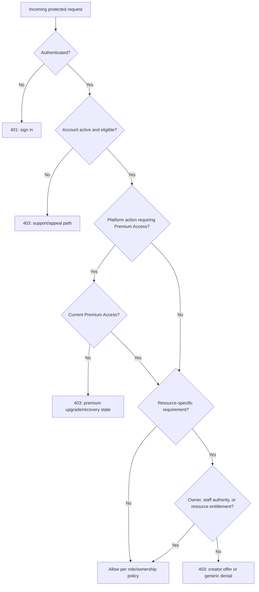

# Creator Hub — Technical Architecture Specification

> **Creator and support disclosure:** The creator of this project is **Kaden McCullen**. Kaden independently came up with the project, its direction, and its requirements. To support Kaden, artificial intelligence provided Kaden research and code to support their project; it did not independently originate the project or make the product decisions.

**Status:** Implementation specification  
**Architecture style:** Modular full-stack application with provider-managed payments, payouts, storage/CDN, and live video.  

## 1. Architecture Principles

Creator Hub should begin as a modular monolith. The public web client, application/API server, relational database, authorization service, and payment/webhook handler are deployable as one logical product while retaining strict domain boundaries. This minimizes early operational burden yet enables the payment, media, live-video, messaging, and moderation modules to be separated later if load or regulatory requirements warrant it.

The system follows five non-negotiable principles: **Premium Access precedes network participation; authorization is server-enforced; payment providers own payment credentials; media delivery is tokenized after authorization; and high-impact operational actions are auditable.** Access must be denied unless an explicit policy grants it. Authentication and authorization are different controls: proving that a person has signed in does not prove that they may act on or see a resource.[1]

## 2. Logical System Architecture

## 3. Trust Boundaries and Security Responsibilities

| Boundary | Trusted responsibility | Do not trust | Mandatory control |
|---|---|---|---|
| Browser to application | Presentation, authenticated request transport, user input | Role, entitlement, price, checkout completion, hidden UI, resource IDs | TLS, input validation, server-side authorization, CSRF/session controls, rate limits. |
| Public to Premium Access | Marketing/pricing display only | A browser declaration that it has paid | Verify current platform entitlement from authoritative server records before resolving premium routes. |
| Premium Access to creator resource | Active network eligibility | A platform membership as proof of creator-specific access | Check creator membership, PPV, ticket, owner, and contact-policy authorization for every protected action. |
| Application to payment provider | Server-issued checkout parameters and provider webhook payload only after verification | Redirect/query parameters, forged/replayed webhook data | Server-side API key, raw-body signature verification, event idempotency, provider event metadata checks. |
| Application to storage/CDN | Expiring upload/download authorization | Storage object path as an access right | Private bucket/origin, short-lived signed URL/cookie, asset/resource entitlement check. |
| Application to video provider | Ingest/playback identifiers and expiring viewer authorization | Client-side event/entitlement claim | Server-issued creator ingest permission and playback token only after authorization. |
| Staff to operations | Assigned role and case workflow | Broad admin status as a substitute for case scope | MFA for privileged roles, least privilege, reasoned action, immutable audit log. |

## 4. Premium-Entry Authorization Architecture

### 4.1 Policy inputs

The central policy service accepts an authenticated subject, requested action, resource attributes, relationship attributes, and environmental conditions. It must return a deterministic decision and a reason code appropriate for the caller. The decision can be cached only for a short period, and must be invalidated after membership, account-status, suspension, refund, chargeback, or contact-setting changes.

| Input category | Examples |
|---|---|
| Subject | User ID, primary role, account status, MFA/re-authentication state, age/eligibility state, safety restrictions. |
| Platform relationship | Current Premium Access entitlement, premium subscription state, plan/grace policy, access expiration. |
| Creator relationship | Creator profile status, creator membership, PPV/ticket entitlement, follow/contact setting, block status. |
| Resource | Resource type/id, owner creator, publishing state, access type, membership tier, purchase/ticket product, event window. |
| Environment | Request origin, session/device risk signal, rate-limit status, jurisdiction/availability flag where policy requires it. |

### 4.2 Decision layers

Actions that require Premium Access include discovery, profile/feed access, creator offers, follow/contact, messaging, comments/reactions, tips, creator-level checkout, library access, event discovery, and live lobby access. Creating a creator application, completing billing recovery, reading policies, and contacting support remain accessible outside the premium network.

### 4.3 Core policy interfaces

| Policy function | Inputs | Result |
|---|---|---|
| `requirePremiumAccess(subject)` | account status, current `premium_access` entitlement, plan/grace state | Allows network participation or returns upgrade/recovery denial. |
| `canViewCreatorProfile(subject, creator)` | Premium Access, public teaser policy, creator approval/discoverability | Full profile, limited teaser, or denial. |
| `canAccessContent(subject, content)` | Premium Access, post state, owner/staff relation, creator membership, PPV entitlement | Content metadata and short-lived asset credential or upgrade state. |
| `canMessageCreator(subject, creator)` | Premium Access, account status, creator contact policy, relationship, blocks, rate limits | Existing/new conversation permission. |
| `canEnterLiveEvent(subject, event)` | Premium Access, event state/window, member/ticket entitlement, owner/staff relation | Lobby/playback permission and short-lived provider token eligibility. |
| `canCreateCheckout(subject, product)` | Premium Access where required, product state, self-purchase prevention, creator payout readiness | Server-created provider checkout session or denial. |
| `canModerate(subject, case)` | Staff role, assigned scope, case state, re-authentication | Allowed specific action and audit obligation. |

## 5. Domain Model and Database Requirements

The relational database is the source of truth for identities, platform policies, creator configuration, content metadata, application-specific fulfillment state, moderation, and audit records. It is not the source of truth for card data, raw payment methods, payment-provider secret material, full provider payloads, or media bytes. Any local copy of provider status must have a documented purpose, event source, idempotency behavior, and reconciliation route.

### 5.1 Principal entities

| Domain | Entity | Required purpose and fields |
|---|---|---|
| Identity | `users` | Internal ID, identity-provider ID, display/contact attributes, role, account status, age acknowledgement, consent timestamps, lifecycle timestamps. |
| Creator | `creatorProfiles` | User owner, handle, display name, description, profile assets, category, discoverability, approval status, payout readiness. |
| Platform access | `platformAccessPlans` | Stable plan code, title, provider product/price IDs, billing interval, availability, default policy flags. |
| Platform access | `platformSubscriptions` | User, plan, provider customer/subscription IDs, locally needed authorization cache, period references, revocation/grace reason. |
| Creator access | `membershipTiers`, `subscriptions` | Creator/tier relationship, provider identifiers, active/expired/canceled state cache required for entitlement fulfillment. |
| Catalog | `products`, `posts`, `contentAssets`, `bundles` | Creator ownership, resource linkage, title/description, product type, provider price reference, publication state, storage metadata. |
| Commerce | `orders`, `paymentEvents`, `tips` | Buyer, seller/creator, product, provider identifier, business-specific fulfillment/ledger linkage, state transition record. |
| Entitlement | `entitlements` | Subject, scope, resource, source, active/grace/expired/revoked state, valid period, reason and provenance. |
| Live | `liveEvents`, `eventAttendance`, `streamSessions` | Creator, schedule, access condition, provider stream ID, attendance/audit status, chat policy. |
| Engagement | `follows`, `conversations`, `messages`, `blocks` | Relationship state, sender/recipient, conversation status, message metadata, restriction/block effect. |
| Trust and safety | `reports`, `moderationActions`, `policyVersions`, `appeals` | Reporter/subject/reason, case state, action/rationale, policy version, review trail. |
| Advertising | `adPlacements`, `campaigns`, `adImpressions` | Sponsor, creator/placement scope, disclosure, targeting consent rule, review state, delivery and measurement record. |
| Audit | `auditLogs`, `accessEvents` | Actor/service, action, target, policy decision/outcome, correlation ID, timestamp, redacted metadata. |
| Token economy | `tokenAccounts`, `tokenLedgerEntries` | User wallet status and append-only credit/debit/reversal records with idempotency and provider references. |
| Private collaboration | `engineeringWorkspaces`, `engineeringWorkspaceMembers` | Isolated workspace ownership, role membership, lifecycle status, MFA verification timestamp, and access boundary. |

### 5.2 Required relationship and integrity rules

| Rule | Database/API enforcement |
|---|---|
| One creator profile per owning user | Unique `creatorProfiles.userId`; an owner cannot create a second profile without policy approval. |
| Public creator handle is unique | Unique normalized handle; updates preserve redirect/alias policy. |
| A creator cannot buy their own offer | Server policy compares purchasing user to product creator owner. |
| A fan–creator conversation is unique | Unique `(fanId, creatorId)` and restricted status. |
| A provider checkout/event is processed at most once | Unique provider checkout/event identifier plus transactionally idempotent handler. |
| Entitlement is not duplicated | Uniqueness appropriate to user/resource/source; handler must upsert or safely no-op for replayed provider events. |
| Asset records do not grant access | `storageKey` is opaque metadata; authorization runs before a signed delivery request. |
| Ads are not delivered before approval | Query predicate requires `approved`, current campaign window, and consent compatibility. |
| Token gifts cannot bypass policy | `tokens.giftEligibility` requires active account, Premium Access, approved creator, enabled tipping, and a positive integer amount. Ledger settlement must be provider-backed and idempotent. |
| Private workspaces are isolated | `workspaces.create` requires Premium Access plus creator/admin authority; workspace listing requires Premium Access and active membership. MFA is required by default and must be asserted by the identity provider. |

### 5.3 Premium Access schema extension

| Change | Requirement |
|---|---|
| Add `premium_access` entitlement type | It represents the platform-wide gate for membership authorization. |
| Add platform plan/subscription tables | They are distinct from `membershipTiers`/creator subscriptions and have separate provider price references. |
| Add source/status lifecycle | Events must map to pending, active, grace, canceled-at-period-end, expired, revoked, refunded, and disputed states under documented policy. |
| Add correlation/audit fields | Every access grant/revoke should be traceable to a provider event, audited staff action, or policy rule. |
| Add creator contact settings | Store whether Premium Access, creator membership, or no incoming contact is permitted. |

## 6. API Specification

The application uses typed RPC procedures. Every protected procedure calls the central authorization service at the boundary; client components do not duplicate policy decisions except to render available UI optimistically.

### 6.1 Public and identity procedures

| Procedure | Caller | Input | Server behavior | Output |
|---|---|---|---|---|
| `plans.listPremium` | Public | locale/currency context | Returns active Premium Access plans only. | Plan display model; never raw provider secret/metadata. |
| `auth.me` | Public | none | Resolves authenticated account/session. | User summary, account status, premium status summary. |
| `creatorApplications.create` | Active authenticated user | profile/application form | Validates eligibility and creates draft/submission. | Application ID/status. |
| `policies.current` | Public | locale | Returns published policy versions. | Policy metadata/content link. |

### 6.2 Premium network procedures

| Procedure | Precondition | Function | Failure behavior |
|---|---|---|---|
| `discover.list` | `requirePremiumAccess` | Query discoverable approved creators with pagination/filter. | `PREMIUM_REQUIRED` without leaking directory records. |
| `creators.get` | `requirePremiumAccess` or teaser policy | Get creator profile/configured preview. | Premium upgrade or generic unavailable. |
| `follows.toggle` | Premium Access + active account | Add/remove own follow. | Deny inactive/lapsed/restricted account. |
| `conversations.getOrCreate` | `canMessageCreator` | Open existing or create eligible conversation. | Generic unavailable or upgrade required. |
| `messages.send` | Participant + Premium Access + conversation active | Validate/store message and audit safety event. | Deny/limit/restrict. |
| `library.list` | Premium Access + active account | Return own current/past authorized resources. | Billing recovery state for lapsed Premium Access. |
| `live.list` | Premium Access | Return eligible/marketable scheduled events. | Premium upgrade state. |
| `tokens.giftEligibility` | Premium Access + approved creator + tip policy | Validate token-gift prerequisites without trusting client state or issuing balance changes. | Eligibility decision and denial reason. |
| `workspaces.mine` | Premium Access + active membership | Return only the caller’s active private-workspace memberships. | Redacted workspace membership view. |
| `workspaces.create` | Premium Access + creator/admin role | Create an MFA-required workspace and owner membership; audit the action. | Workspace ID/status. |

### 6.3 Content, live, and media procedures

| Procedure | Precondition | Function | Output |
|---|---|---|---|
| `posts.get` | `canAccessContent` | Returns content body/metadata only for allowed state. | Public/membership/PPV/owner/staff content model. |
| `assets.getDeliveryUrl` | `canAccessContent` | Generates/requests short-lived delivery URL/cookie. | Credential expiration plus redacted asset metadata. |
| `events.getLobby` | Premium Access + event visibility policy | Returns event details and entry state. | Lobby model without playback credentials. |
| `events.getPlaybackAccess` | `canEnterLiveEvent` | Creates short-lived provider playback credential. | Token/media state, expiration, event status. |
| `chat.send` | Event entry + chat policy | Validates sender/event state before message transmission. | Sent message ID/status or denial. |

### 6.4 Commerce procedures and webhook endpoints

| Procedure/endpoint | Caller | Critical controls |
|---|---|---|
| `premiumCheckout.create` | Signed-in account | Validate plan/server price, active account, no conflicting subscription policy; create hosted checkout and correlation record. |
| `creatorCheckout.create` | Active Premium Access member | Validate Premium Access, product state, creator payout readiness, self-purchase prevention; create hosted checkout. |
| `tipsCheckout.create` | Active Premium Access member | Validate recipient/amount/limits; create provider payment with clear tip policy. |
| `billing.getPortalUrl` | Account owner | Create provider-managed customer portal session; never expose billing secret information. |
| `POST /api/stripe/webhook` | Payment provider | Raw-body request, signature verification, event-id idempotency, minimal data capture, transactional fulfillment, short response time. |
| `POST /api/video/webhook` | Video provider | Verify signature/callback secret, map provider event to owned event, audit status transition. |

Stripe documents that webhook verification depends on the unmodified raw request body, the `Stripe-Signature` header, and the endpoint’s signing secret; registered production endpoints are HTTPS.[2]

### 6.5 Error model

| Code | User-visible behavior | Logging requirement |
|---|---|---|
| `UNAUTHENTICATED` | Direct to sign-in and preserve a safe return path. | Session/correlation ID; never log secret/session token. |
| `PREMIUM_REQUIRED` | Show Premium Access plan/recovery page. | Account ID, route/action, premium state reason. |
| `RESOURCE_ENTITLEMENT_REQUIRED` | Show creator membership/PPV/ticket option only if product is eligible. | User/resource/policy reason. |
| `FORBIDDEN` | Generic “not available” message with support/appeal link where applicable. | Subject/resource/action/policy reason. |
| `ACCOUNT_RESTRICTED` | Safe, non-disclosing support/appeal message. | Account state and enforcement case reference. |
| `RATE_LIMITED` | Tell user to retry later. | Action, threshold, device/session risk metadata. |
| `PROVIDER_UNAVAILABLE` | Preserve pending state and provide retry/support guidance. | Provider endpoint/event/correlation ID. |

## 7. Payment, Billing, Fee, and Payout Specification

### 7.1 Fund-flow model

The business must select and document its merchant-of-record, tax, and payout model before enabling live funds. The technical baseline assumes a marketplace capability: Premium Access revenue belongs to the platform, while creator products/tips/tickets are collected according to the selected marketplace flow and then allocated to eligible creators net of disclosed fees, refunds, disputes, reserves, and adjustments. Payment-provider marketplace documentation describes a pattern to collect customer payments and pay a portion to sellers or service providers.[3]

| Transaction | Payer | Provider object | Internal result | Entitlement result |
|---|---|---|---|---|
| Premium Access subscription | Fan | Customer/subscription/invoice or checkout session | Platform membership record and audit/ledger entry | `premium_access` active for current valid period. |
| Creator membership | Premium member | Creator-related subscription/checkout | Creator sale/fee allocation record | `creator_membership` for creator/tier period. |
| PPV post/bundle | Premium member | One-time payment/checkout | Order and allocation record | `post_purchase` or bundle entitlement. |
| Live ticket | Premium member | One-time payment/checkout | Order and allocation record | `live_ticket` for specified event window. |
| Tip | Premium member | One-time payment | Tip/fee allocation record | No access entitlement by default. |
| Refund/dispute | Provider/platform staff | Refund/dispute event | Adjustment/reversal, creator-balance policy application | Revoke/retain access only according to documented policy. |

### 7.2 Provider event handling

The event handler must receive payment/subscription lifecycle events, verify each signature, deduplicate by event ID, record only the necessary provider identifier/data, and perform database changes in a single transaction where feasible. It must acknowledge successful receipt quickly and schedule slow noncritical work separately. The handler must not grant access from a success redirect, client mutation response, or unsigned provider callback.

| Provider event category | Required platform action |
|---|---|
| Checkout/payment completed | Verify, locate correlation, set fulfilled record, create/refresh relevant entitlement, audit. |
| Invoice paid/subscription active | Create/refresh Premium Access or creator membership entitlement through idempotent transition. |
| Payment failed/overdue | Apply explicit grace or lapsed policy; restrict new activity according to Premium Access rules. |
| Subscription canceled/ended | Set end date and remove access only when period/policy ends. |
| Refund/chargeback/dispute | Apply documented entitlement and financial adjustment behavior; surface support case if required. |
| Payout/connected-account change | Update readiness/reconciliation state; do not infer creator eligibility from a client claim. |

### 7.3 Financial ledger and reconciliation

A ledger entry is immutable after posting. Corrections are separate reversing or adjusting entries, never updates that erase transaction history. A daily reconciliation compares provider settlement/payout records to internal order, fee, reserve, adjustment, and entitlement records. A mismatch produces an operations task and preserves the provider correlation IDs needed for investigation.

The IRS identifies digital platforms as businesses that may need to address worker classification, payment reporting, taxes, and filing; the exact obligations depend on the legal and operational model.[4] The system should support exports and retention, not present tax advice or self-certify compliance.

## 8. Protected Media and Live Video Specification

### 8.1 Media controls

| Stage | Requirement |
|---|---|
| Upload | Creator requests upload authorization from server; server verifies owner/role/policy, returns a scoped upload credential, then stores file metadata after completion. |
| Storage | Source objects are private. The database stores opaque provider/storage keys, MIME type, byte size, moderation state, and linked platform resource. |
| Review | Asset can be pending/approved/rejected/removed. Publication cannot use unapproved asset state where policy requires review. |
| Delivery | A content request runs entitlement/ownership check, then returns only a short-lived signed URL/cookie/token. Credentials are resource-scoped and expire promptly. |
| Revocation | Suspension, refund/revoke, content removal, or expiry prevents issuance of new credentials and invalidates provider session where supported. |
| Deterrence | Dynamic watermarking, download policy, rate limits, and anomaly alerts may discourage abuse. They do not guarantee prevention of screen capture. |

### 8.2 Streaming controls

Creators receive a provider ingest credential only after approval and access to their own event. Fans never receive ingest information. A live-event playback token is created only after Premium Access and event-specific authorization have passed. Live chat follows both event entry and event/creator chat policy. The initial system should use managed HLS or WebRTC technology via a specialist provider rather than operate its own transcoding/edge stack.

| Live operation | Owner | Required control |
|---|---|---|
| Event creation | Creator | Validate creator role, approval, schedule, access rule, and product linkage. |
| Ingest start/stop | Creator/provider | Scoped, rotating provider credential; server/provider callback records status. |
| Lobby | Premium member | Validate Premium Access; show ticket/membership requirements but no playback secret. |
| Playback | Entitled viewer | Issue expiring token after account, Premium Access, event, membership/ticket, and safety checks. |
| Chat | Entitled viewer + creator/moderator | Rate limits, visibility rules, report action, block/restrict enforcement, audit. |
| Replay | Policy-dependent | Model replay as a separately entitled resource with its own validity period. |

## 9. Safety, Privacy, Advertising, and Governance

### 9.1 Safety operations

The safety workflow is deliberately human-led. A report produces a case state (`open`, `under_review`, `actioned`, `dismissed`), links subject/reporter evidence within policy, and retains a moderator action log. Moderators have narrowly scoped decisions such as note, restrict, remove, suspend, restore, or dismiss; finance and content rights remain separate authorities.

| Control | Requirement |
|---|---|
| Age/eligibility | Record acknowledgement and use a configurable age-assurance/eligibility policy. Do not assume acknowledgement alone satisfies every jurisdiction. |
| Creator consent/verification | Complete required agreement/eligibility checks before publishing paid content or enabling payouts. |
| Reporting | Accept profile, post, asset, message, event, and ad reports; validate input; rate-limit abuse; create case/audit record. |
| Moderation | Maintain role-scoped queue, rationale, target, policy version, timestamp, and appeal route where policy supplies one. |
| Blocks/restrictions | Enforce bidirectionally in all message, follow, notification, and interaction APIs. |
| Escalation | Preserve evidence/handling instructions according to formal policy; route urgent incidents to designated operations. |

### 9.2 Privacy and data lifecycle

Privacy requirements should apply data minimization, purpose limitation, least access, retention/deletion schedules, access/export/correction workflow, consent recording, and contractual vendor review. The business must determine the legal basis, geography, and policy language applicable to its launch. Application logs must redact secrets, full payment attributes, raw payment payloads, access tokens, and sensitive user content.

### 9.3 Advertising and sponsorship

The ad service uses an approval gate. Only approved campaigns within date range, assigned placement, and permitted consent context can return a display model. The model includes an obvious sponsor/disclosure label. The Federal Trade Commission’s endorsement/influencer materials discuss material connection disclosures in social-media and influencer marketing.[5]

## 10. Operational, Reliability, and Security Requirements

| Area | Initial requirement | Launch maturity requirement |
|---|---|---|
| Authentication | Secure session cookie, identity provider, generic error copy, login throttling. | MFA/re-authentication for staff/high-risk changes, device/session management, account recovery safeguards. |
| Authorization | Central policy functions and route-level checks. | Automated access-policy regression suite, periodic access review, policy versioning. |
| Availability | Stateless API instances, managed database/provider dependencies. | Defined SLOs, capacity tests, incident response, tested recovery objectives. |
| Observability | Structured server logs, correlation IDs, audit events, provider webhook status. | Metrics/alerts for checkout failures, entitlement denial spikes, delivery errors, stream access failures, moderation backlog, payout mismatches. |
| Data resilience | Managed database backups and rollback-safe migrations. | Restore exercise, documented RPO/RTO, provider outage runbooks. |
| Secure delivery | Dependency scanning, reviewable migrations, CI typecheck/tests. | Security testing against authorization bypass, webhook replay, IDOR, CSRF/XSS, rate-limit, and secret exposure scenarios. |
| Performance | Paginated lists, server-side filters, CDN for public assets. | Load tests for discover feed, checkout spikes, and live-event admission; cache only non-sensitive derived data. |

## 11. Release Plan and Acceptance Gates

| Release | Scope | Required acceptance gate |
|---|---|---|
| R0 — Public and onboarding | Landing, policies, account creation, creator application, Premium Access plan selection. | No real creator directory or interaction exposed without Premium Access. |
| R1 — Premium Access | Provider checkout, verified webhooks, platform entitlement, premium discovery. | Automated event-replay/idempotency and lapsed-membership tests pass; billing recovery works. |
| R2 — Creator commerce | Creator profiles, memberships, protected posts/assets, PPV, tips, library. | Ownership/entitlement tests, storage access review, creator payout readiness enforcement. |
| R3 — Engagement and live | Messaging, blocks/reporting, live scheduling/entry/chat, managed video connection. | Message policy tests, token expiry/access test, live-event admission load test, moderation runbook. |
| R4 — Operations and ads | Staff queues, payout reconciliation, sponsored placements, disclosures, reporting. | Approval gate, audit traceability, financial reconciliation, policy/legal review completion. |

## 12. Production Readiness Checklist

The platform may not handle live creator payments, protected media, or real broadcasts until the following are confirmed: payment provider production setup and webhook verification; marketplace/creator payout method; legal/age/content/privacy policy decisions for launch geography; creator agreement and verification workflow; storage/CDN privacy/token configuration; streaming provider and moderation controls; incident/reporting escalation; terms/privacy/billing/refund documentation; audit/alerting; database backups/restoration; accessibility review; and security testing. This checklist is an engineering control and not legal, tax, or regulatory advice.

## References

[1]: https://cheatsheetseries.owasp.org/cheatsheets/Authorization_Cheat_Sheet.html "OWASP Authorization Cheat Sheet"
[2]: https://docs.stripe.com/webhooks "Stripe — Receive webhook events"
[3]: https://docs.stripe.com/payments "Stripe — Payments and marketplace integration"
[4]: https://www.irs.gov/businesses/gig-economy-tax-center "Internal Revenue Service — Gig Economy Tax Center"
[5]: https://www.ftc.gov/business-guidance/advertising-marketing/endorsements-influencers-reviews "Federal Trade Commission — Endorsements, Influencers, and Reviews"
