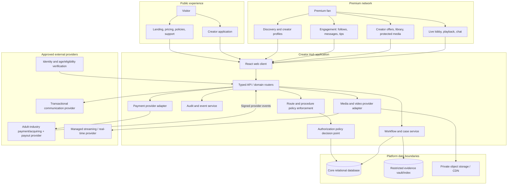
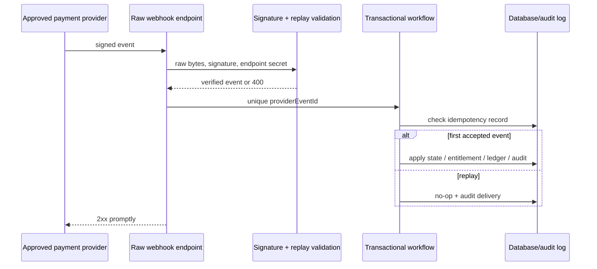

# Creator Hub — Technical Specification

**Author:** Manus AI  
**Version:** 2.0 — canonical technical specification  
**Architecture:** Modular full-stack application with separate restricted-evidence and provider-adapter boundaries.  
**Primary deployment assumption:** Stateless web/API service on managed infrastructure, managed relational database, private object storage/CDN, provider-managed identity/verification/payment/video services, and dedicated staff operations controls.

> **Design for verification, not assertion.** The browser can request an action; the server must determine whether the account, premium membership, creator relationship, resource entitlement, and operational policy allow it.

## 1. System Context



The application is a modular monolith until scale, availability, or restricted-evidence requirements justify split services. The authorization policy, payment adapter, media adapter, and restricted-evidence boundary are module contracts from the first release so the system does not embed provider-specific or compliance-sensitive logic into the UI.

## 2. Core Architecture Rules

| Rule | Engineering implementation |
|---|---|
| Premium network is server-gated | Every premium page query/action calls `requirePremiumAccess`; the server returns no real directory/profile/offer/message/event data to nonmembers. |
| Multiple access requirements accumulate | `Premium Access` AND creator/resource eligibility must be true. Premium membership alone does not authorize protected creator assets or contact. |
| Provider-independent payments | Use `PaymentProviderAdapter`; provider selection is deployment configuration after written eligibility/underwriting confirmation. Generic Stripe implementation remains disabled for adult-content fund flows because the retrieved policy lists adult services/pay-per-view/adult live-chat under prohibited business categories.[1] |
| Evidence is separate | Ordinary account/profile/media tables store limited references/status only. Compliance identity/age/consent evidence lives in a restricted encrypted evidence domain with its own access and audit rules. |
| Raw card data never enters application | Provider-hosted checkout/portal or provider-approved tokenized components are mandatory. PCI DSS applies to environments that store, process, or transmit payment account data, and encryption alone does not necessarily remove the environment from scope.[2] |
| Media origin is private | Media metadata is not access; each delivery/playback request is authorized and mints an expiring provider credential. |
| Operations are attributable | Security-sensitive and operationally high-impact actions generate append-only audit events with actor/service, target, reason/policy, correlation, and outcome. |

## 3. Authorization Architecture

### 3.1 Policy evaluation

The application shall use a combined role-, attribute-, and relationship-based model. Roles scope administrative functions; attributes express current account/premium/verification/resource state; relationships express ownership, active subscription, PPV/ticket entitlement, block, conversation participation, and staff case assignment. OWASP specifically recommends least privilege, deny-by-default, validation on every request, and preference for attribute/relationship-based access controls where appropriate.[3]

```ts
type AuthorizationRequest = {
  subject: {
    id: number | null;
    role: "visitor" | "fan" | "creator" | "moderator" | "finance" | "admin";
    accountStatus: "pending_verification" | "active" | "restricted" | "suspended" | "closed";
    premiumStatus: "none" | "active" | "grace" | "lapsed" | "revoked";
    staffAssurance?: "standard" | "mfa" | "reauthenticated";
  };
  action: string;
  resource: { type: string; id?: number; ownerUserId?: number; creatorId?: number; state?: string; accessType?: string };
  relationships: { isOwner?: boolean; hasCreatorMembership?: boolean; hasPPV?: boolean; hasTicket?: boolean; isBlocked?: boolean; isParticipant?: boolean; staffAssignment?: boolean };
  environment: { now: Date; requestId: string; riskFlags?: string[] };
};

type AuthorizationDecision = {
  allowed: boolean;
  code: "ALLOWED" | "UNAUTHENTICATED" | "PREMIUM_REQUIRED" | "ENTITLEMENT_REQUIRED" | "ACCOUNT_RESTRICTED" | "FORBIDDEN" | "STEP_UP_REQUIRED";
  policyId: string;
  safeUserMessage: string;
  auditRequired: boolean;
};
```

### 3.2 Core policies

| Policy ID | Rule |
|---|---|
| `PREM-001` | Premium-network actions require authenticated, active, eligible account with current `premium_access` entitlement. Grace access is explicitly configured per action; default is no new engagement/purchase/contact. |
| `PREM-002` | Public policy, support, rights request, billing recovery, sign-in, and creator-application routes are not premium-network actions. |
| `CRE-001` | A creator may modify only a resource owned by their approved creator profile; draft-only capability may exist before payout/product approval. |
| `CONTENT-001` | A published resource requires Premium Access plus owner/staff authority or active creator membership/PPV/ticket entitlement matching the resource. |
| `CONTACT-001` | Conversation creation and message send require Premium Access, active participant accounts, contact setting/relationship, no block/restriction, rate limits, and content safety policy. |
| `LIVE-001` | Live playback requires Premium Access, active event state/window, owner/staff authority or current membership/ticket entitlement, and no restrictive safety state. |
| `STAFF-001` | Staff action requires assigned capability + case/resource scope; high-impact actions require MFA/re-authentication and a mandatory audit event. |
| `EVID-001` | Restricted evidence can be accessed only by named compliance roles under time-bound, case-scoped, auditable approval. No generic administrator read bypass exists. |

### 3.3 Route gate matrix

| Route family | Required check | Response if denied |
|---|---|---|
| `/` `/pricing` `/safety` `/policies/*` `/support` | Public access. | Never show premium resource data. |
| `/apply` | Authenticated + application eligibility. | Sign-in or support/eligibility response. |
| `/explore` `/creator/:handle` | `requirePremiumAccess`; teaser path only if separately published. | Plan/recovery page; generic unavailable where profile existence is private. |
| `/creator/:handle/offer/*` | Premium + profile visibility + product active. | Generic unavailable or premium recovery. |
| `/library` `/messages` `/live` | Premium + account active. | Premium recovery/restriction path. |
| `/post/:id` `/asset/:id` `/event/:id/play` | Premium + resource-specific policy. | Entitlement offer only if permitted; no source URL/media bytes. |
| `/studio/*` | Creator active + ownership + feature readiness. | Creator onboarding/review/payout readiness state. |
| `/ops/*` | Staff scope + MFA/re-auth where flagged. | 403 generic and security audit. |
| `/records/*` | Restricted evidence assignment + step-up authentication. | 403 generic and security audit. |

## 4. Domain Data Model

### 4.1 Core identity and entitlement tables

| Table | Key fields | Constraints and purpose |
|---|---|---|
| `users` | `id`, identity provider reference, role, account state, locale, created/updated timestamps | Do not use display fields as identity evidence. One user has one primary role; capability assignment may supplement staff roles. |
| `userEligibility` | `userId`, age/eligibility vendor reference, status, checkedAt, recheckAt, jurisdiction policy version | Stores outcome/reference, not raw identity document; encrypted at rest. |
| `platformAccessPlans` | `id`, code, display values, provider product/price references, availability, terms/policy version | Server is authoritative for price/plan selection. |
| `platformSubscriptions` | `userId`, plan, provider customer/subscription reference, status cache, current period reference | Unique active-plan rule per user/plan as policy requires. |
| `entitlements` | subject, `resourceType`, resource, source, status, valid range, revocation reason, correlation | `premium_access` is the platform network entitlement; it must not be conflated with creator/resource access. |
| `accountRestrictions` | user, type, reason category, case ID, starts/ends, actor | Central query for every interaction gate. |

### 4.2 Creator, content, commerce, and relationship tables

| Table | Key fields | Constraints and purpose |
|---|---|---|
| `creatorProfiles` | owner user, unique handle, visibility, review status, payout readiness, contact policy, current policy version | One per user; public directory query requires approved/discoverable state. |
| `creatorApplications` | user, state, agreement version, external verification refs, reviewer/outcome | Append new decision records or audit history; never overwrite approval reason. |
| `membershipTiers` | creator, display config, provider reference, status | Publish requires creator/payout/provider readiness. |
| `creatorSubscriptions` | fan, creator, tier, provider subscription ref, status cache | Unique active relationship as appropriate; provider event is source for lifecycle. |
| `posts` / `products` / `bundles` | creator, access type, publication status, product/provider refs, content links | A product is not the access decision; post state and entitlement are evaluated together. |
| `contentAssets` | creator, storage key, checksum, MIME/size/duration, moderation state, linked resource | Private origin, immutable checksum, no public URL stored as access grant. |
| `orders` / `paymentEvents` / `tips` | provider/correlation refs, buyer/creator/resource, business fulfillment/ledger fields | Do not duplicate payment card details or raw provider payload; enforce provider event idempotency. |
| `ledgerEntries` / `payoutBatches` | business allocation/refund/reserve/adjustment references | Append-only double-entry or equivalent auditable pattern; corrections are new entries. |
| `follows` / `blocks` / `conversations` / `messages` | subject relationships, state, encrypted/redacted content metadata, report refs | Unique conversation relationship; blocks are evaluated in all relevant actions. |
| `liveEvents` / `streamSessions` / `attendance` / `chatMessages` | provider IDs, schedule/state, access config, token issue/audit fields | Stream session/token is short-lived; ingest and playback credentials stay out of ordinary logs. |
| `reports` / `moderationActions` / `appeals` / `cases` | reporter/subject, priority/status, action/rationale/policy version | Sensitive case data has staff scope. |
| `adCampaigns` / `adPlacements` | sponsor, disclosure, consent context, approval status/window | Serving query must require approved/current/consent-compliant status. |
| `auditLogs` / `securityEvents` | actor/service, correlation, action, target, result, redacted metadata | Append-only, time-synchronized, retention per policy. |

### 4.3 Restricted evidence domain

| Component | Requirement |
|---|---|
| `evidenceSubjects` | Internal opaque subject ID tied to creator/performer/application without exposing legal identity in regular profile queries. |
| `evidenceArtifacts` | Encrypted file/object reference, checksum, category, source, intake/review timestamp, retention hold/expiry, case link. |
| `evidenceIndexes` | Counsel-approved mapping needed for covered work/performer/alias/identifier/production/event reference; search is access-controlled and audited. |
| `evidenceAccessGrants` | Case-scoped, role/approver/time-bound permission with purpose, access log, and revocation. |
| `legalHolds` | Hold/expiry/destruction status that overrides routine retention deletion and records authorizing authority. |

The exact required record/evidence scope must be confirmed by counsel. The retrieved federal regulation discusses, for covered material, performer identity/age records, index/cross-reference requirements, depiction/URL/identifying references, and live Internet depiction records.[4]

## 5. API and Event Contracts

### 5.1 API conventions

All internal application APIs use typed RPC contracts. A procedure categorizes itself as public, authenticated, premium, creator, staff, or evidence restricted; the category is a convenience only. Every individual resource action still calls the relevant authorization policy. Inputs are schema-validated; outputs are role-specific view models. IDs are opaque to the client where enumeration risks exist, and object authorization is never inferred from knowing an ID.

| Domain router | Essential procedures |
|---|---|
| `auth` | `me`, session/re-auth state, logout, privacy/right request initiation. |
| `eligibility` | start/return/status of approved vendor workflow; no raw evidence payload exposed. |
| `premium` | list plan, create checkout, billing portal, premium status/history. |
| `discovery` | list/get premium-authorized creator views, saved/follow state. |
| `creatorApplication` | create/update/submit/withdraw; applicant status. |
| `studio` | profile/tier/post/product draft/publish workflow, asset upload authorization, creator-status checks. |
| `catalog` | eligible offers, post metadata, product detail. |
| `entitlements` | current fan library, access check, revoke/refresh audit. |
| `media` | upload authorization, completion, delivery access; never static public media URL. |
| `billing` | creator membership/PPV/tip checkout, receipts, cancellation, refund-support initiation. |
| `messages` | list/create conversation, send/read/restrict/report. |
| `live` | schedule/lobby/entry token/chat/report. |
| `trustSafety` | create report, own report status, staff queue/case/action/appeal. |
| `advertising` | creator campaign request, staff approval, eligible placement view. |
| `operations` | staff-only financial reconciliation, restrictions, audit search; separated by role/case scope. |

### 5.2 Payment provider adapter

```ts
interface PaymentProviderAdapter {
  getCapability(): Promise<{
    approvedForAdultContent: boolean;
    approvedForRecurring: boolean;
    approvedForPPV: boolean;
    approvedForTips: boolean;
    approvedForMarketplacePayouts: boolean;
    supportedJurisdictions: string[];
    policyVersion: string;
  }>;
  createSubscriptionCheckout(input: ApprovedPremiumPlanCheckout): Promise<{ checkoutRef: string; redirectUrl: string }>;
  createCreatorCheckout(input: ApprovedCreatorPurchaseCheckout): Promise<{ checkoutRef: string; redirectUrl: string }>;
  createTipCheckout(input: ApprovedTipCheckout): Promise<{ checkoutRef: string; redirectUrl: string }>;
  createBillingPortal(input: AccountOwnerInput): Promise<{ redirectUrl: string }>;
  verifyWebhook(input: RawWebhookRequest): Promise<ProviderEvent>;
  getPayoutReadiness(input: CreatorProviderAccountRef): Promise<PayoutReadiness>;
}
```

The adapter activation guard rejects use when the capability record is absent, expired, or does not affirmatively authorize every intended transaction category. This avoids an unsafe deployment that uses a technically integrated but commercially prohibited processor.

### 5.3 Provider event processing



The provider-event handler must use raw request bytes where the provider requires it, authenticate every callback, execute only idempotent domain transitions, and respond promptly. Stripe’s guidance illustrates the raw-body/signature pattern and HTTPS/2xx expectations for registered webhook endpoints.[5] Any approved adult-industry provider must be integrated according to its own equivalent contract.

### 5.4 Error behavior

| Code | API behavior | UI behavior | Audit/log requirement |
|---|---|---|---|
| `UNAUTHENTICATED` | No premium resource fields. | Sign-in call to action with safe return path. | Request/correlation only. |
| `PREMIUM_REQUIRED` | No directory/offer/contact payload. | Plan/recovery state. | Account/action/policy code. |
| `ENTITLEMENT_REQUIRED` | No protected asset/token. | Creator membership/PPV/ticket option only if eligible. | Subject/resource/policy. |
| `ACCOUNT_RESTRICTED` | Generic safe denial. | Support/appeal path; no sensitive reason leak. | Case reference internally. |
| `STEP_UP_REQUIRED` | No high-risk action. | MFA/re-auth prompt. | User/action/assurance level. |
| `RATE_LIMITED` | Retry-after safe response. | Retry notice. | Rule/threshold/correlation. |
| `PROVIDER_UNAVAILABLE` | No speculative fulfillment. | Pending/retry/support state. | Provider/correlation/retry policy. |

## 6. Protected Asset and Live Video Architecture

### 6.1 Asset flow

| Stage | Server duty | Prohibited implementation |
|---|---|---|
| Upload initiation | Verify creator ownership/status/product workflow, issue short-lived constrained upload authorization. | A long-lived universal write credential in browser/app config. |
| Upload completion | Verify provider callback/object metadata/checksum; create pending asset record. | Publishing directly because client reports upload success. |
| Review/publication | Ensure policy/rights/evidence state allows resource publication. | Using a storage file existence check as review approval. |
| Delivery request | Evaluate Premium Access + resource relationship/entitlement + status; issue short-lived URL/cookie. | Keeping permanent asset URL in post body/database and treating it as protected. |
| Revocation | Stop new delivery credentials immediately; invalidate active provider sessions if supported. | Relying on UI hide or a deleted browser-state flag. |

### 6.2 Live video flow

| Flow | Requirement |
|---|---|
| Creator ingest | Approved creator/event only; unique short-lived rotating provider credential; no fan/API output containing ingest secrets. |
| Viewer lobby | Premium Access check before real-event enumeration; event-specific state/membership/ticket summary only. |
| Playback | Server evaluates all `LIVE-001` conditions then mints resource/event-scoped expiring token. |
| Chat | Independently checks premium/event/participant/block/mute/rate policy for every connection/send/reaction. |
| Audit | Token issuance, entry, remove/mute/ban, report, stream state, and policy failures create auditable events. |
| Replay | Stored/delivered as distinct content product with separate policy, entitlement, and expiry. |

## 7. Security and Privacy Engineering Controls

| Control family | Minimum implementation requirement |
|---|---|
| Authentication | Secure session handling, generic login/recovery errors, rate limits, verified account lifecycle; staff MFA and step-up for sensitive actions. |
| Authorization | Central policies, deny by default, object/resource ownership verification, server-side static/media protection, per-request checks, unit/integration regression suite. |
| Secrets | Server-only environment/secret manager, rotation procedure, no secret logging, repository scanning. |
| Encryption | TLS in transit, encryption at rest for platform data, separate envelope-key/access policy for restricted evidence. |
| Application security | Input schemas, parameterized database access, CSP, output encoding, CSRF/session protection, dependency management, security headers, error boundary with no secret disclosure. |
| Abuse prevention | IP/account/device/behavioral rate limits; account/contact/tip/payment velocity controls; WAF/bot controls compatible with accessibility; human review. |
| Data minimization | Collect only approved business/compliance fields; separate evidence/reference; redact content from application logs; retention/deletion/legal-hold workflow. |
| Privacy rights | Intake/identity verification/status tracking for access/delete/correct/opt-out/limit requests; exceptions/legal holds documented; preference honored in data/ads path. |
| Vendor controls | Document data flow/subprocessors, processor eligibility, DPA/security review, breach notification contacts, source-code access/exit plan, retention/delete API capability. |

The California DOJ’s CCPA overview identifies rights to know, delete (subject to exceptions), correct, opt out of sale/sharing, and limit sensitive-information use/disclosure for covered businesses; it lists financial, precise location, communications, biometric, health, sex-life, and sexual-orientation-related data among sensitive information examples.[6] The platform should therefore classify this data as high sensitivity even before a final jurisdiction-specific legal analysis.

## 8. Accessibility Engineering Requirements

WCAG 2.2 is a W3C Recommendation with testable success criteria, including areas such as non-text content, synchronized media captions, focus, target size, and accessible authentication.[7] The baseline target is WCAG 2.2 AA.

| Area | Required engineering control |
|---|---|
| Typography | Cursive/Old English are decorative only; all functional/contractual/consent/payment/safety/error content uses legible plain type at accessible contrast. |
| Forms | Real labels, error identification/instructions, logical focus, keyboard operation, no timer trap, resubmission/recovery behavior. |
| Authentication/verification | Do not require a cognitive puzzle as the only path; provide accessible alternatives compatible with fraud/age controls. |
| Payment | Provider integration must receive visual/keyboard/screen-reader review; payment errors are announced without revealing sensitive payment details. |
| Video/live | Captions/media alternative/support plan per content/launch policy, accessible player controls, pause/stop behavior, keyboard chat/moderation controls. |
| Responsive UI | Premium gate, pricing, cancellation, support, reports, creator studio, and staff controls work at mobile/desktop breakpoints without horizontal traps or hover-only actions. |

## 9. Nonfunctional Targets

| Category | Target / design requirement |
|---|---|
| Availability | Stateless app instances, health checks, graceful provider failure states, database backups, documented recovery objectives. |
| Performance | Paginated directory/library/messages, server filters, CDN delivery only after authorization, cached non-sensitive configuration; no large asset bytes in DB/API response. |
| Observability | Correlation IDs from UI → API → provider events; metrics for premium-gate denials, checkout attempts/failures, webhook verification, entitlement lag, asset delivery, token issue, reports/backlog, staff actions, privacy requests. |
| Data integrity | Database constraints, transactions for payment/entitlement/ledger transitions, immutable audit/ledger events, migrations reviewed/applied in order. |
| Scalability | Isolate provider adapters and asynchronous long-running work; use managed queues/services for non-request workloads; avoid relying on persistent in-memory session/event state. |
| Recovery | Document provider outage, webhook retry/reconciliation, payment mismatch, stream failure, evidence access outage, content takedown, data breach, and security incident runbooks. |

## References

[1]: https://stripe.com/en-th/legal/restricted-businesses "Stripe — Prohibited and Restricted Businesses"
[2]: https://www.pcisecuritystandards.org/merchants/ "PCI Security Standards Council — Merchant Resources"
[3]: https://cheatsheetseries.owasp.org/cheatsheets/Authorization_Cheat_Sheet.html "OWASP Authorization Cheat Sheet"
[4]: https://www.ecfr.gov/current/title-28/chapter-I/part-75 "eCFR — 28 CFR Part 75"
[5]: https://docs.stripe.com/webhooks "Stripe — Receive webhook events"
[6]: https://oag.ca.gov/privacy/ccpa "California Department of Justice — California Consumer Privacy Act"
[7]: https://www.w3.org/TR/WCAG22/ "W3C — Web Content Accessibility Guidelines 2.2"
